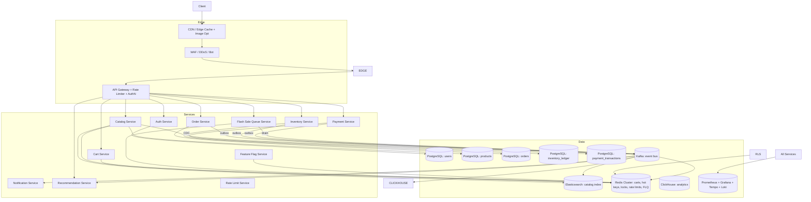

# High-Level & Low-Level Design: Hyperscale Multi-Tenant E-Commerce Platform

**Target Scale:** 100,000 RPS peak (flash sales) · **Availability:** 99.999% · **Multi-tenant:** shared-infrastructure, tenant-isolated data plane
**Version:** 2.0 (integrated with deep research analysis: Shopify BFCM, Shopee C10M, Tencent seckill, 100K RPS best practices)

---

## PART 1: SYSTEM REQUIREMENTS & BOUNDARIES

### 1.1 Functional Requirements (FRs)

#### FR-1: Dynamic Catalog Search & Discovery
- **Ingest path:** Product feeds (PIM/ERP) → `Catalog Ingest` → normalized `products` table → CDC (Debezium) → Elasticsearch index + Redis hot-key cache.
- **Query path:** `GET /api/v1/catalog/search?q=&filters=&sort=&page=` → API Gateway → `Catalog Service` → Elasticsearch (faceted aggregation) → Redis cache (TTL 60s, keyed by normalized query hash) → response.
- **Facets:** category, brand, price range, rating, availability (per-warehouse stock), tenant.
- **Ranking:** BM25 + business boost (revenue velocity, margin, freshness). Personalization via tenant/user profile vector.
- **Multi-tenancy:** every document carries `tenant_id`; index is **shared-index with tenant filter** (routing by `tenant_id` shard routing) to bound shard count at scale.
- **Search autocomplete:** typeahead suggestions from Redis sorted sets (trending + recent + prefix match), backed by ES completion suggester.
- **Search analytics:** click-through, no-result, and query-log events streamed to Kafka → ClickHouse for tuning.

#### FR-2: Distributed Cart Management (Race Conditions)
- **Model:** Redis Hash per cart (`cart:{tenant}:{user_id}`) with field = `sku`, value = `{qty, added_at, price_snapshot}`.
- **Concurrency:** all mutations via **Lua script** (atomic) — no read-modify-write in app layer.
- **Race conditions handled:**
  - *Concurrent add:* `HINCRBY` inside Lua with `HSETNX` for price snapshot.
  - *Concurrent remove vs. add:* single Lua script serializes per-key via Redis single-threaded execution.
  - *Price change mid-session:* cart stores `price_snapshot`; on checkout, `Cart Service` re-validates against current price; delta surfaced to user as `price_changed_items[]`.
  - *TTL/expiry:* sliding TTL 30 days; background sweeper emits `CART_EXPIRED` event.
- **Cart → Order handoff:** `POST /checkout` atomically reads cart (Lua), creates `order` (pending), and emits `CART_LOCKED`; cart is soft-deleted only after order reaches `PAYMENT_PENDING`.
- **Anonymous cart merge:** anonymous cart (`cart:{tenant}:anon:{session_id}`) merged into user cart on login via Lua script (item-level qty sum, price snapshot from newest).
- **Wishlist / Save for Later:** Redis Set per user (`wishlist:{tenant}:{user_id}`) with product IDs; move-to-cart operation.

#### FR-3: Checkout Orchestration & Payment State Tracking
- **Flow:** `Checkout Service` (orchestrator) → validate cart → price re-validation → **Flash Sale Queue (FLQ)** → `Inventory Service` reserve → `Payment Service` initiate → async payment webhook → confirm → `Order Service` finalize → `Notification Service`.
- **Payment state machine (idempotent, event-sourced):**
  `PENDING → AUTHORIZED → CAPTURED → SETTLED`
  `PENDING → AUTHORIZED → VOIDED`
  `PENDING → FAILED`
  `PENDING → EXPIRED`
- **Idempotency:** every checkout carries `Idempotency-Key` (UUIDv7); `payment_transactions.idempotency_key` unique index; duplicate requests return the original `202`/`200` with same `transaction_id`.
- **Webhook handling:** PSP webhooks are **idempotent** — keyed by `psp_event_id`; processed exactly-once via dedupe table + outbox.
- **Multi-PSP routing:** Payment Service routes to primary PSP; on failure/timeout, falls back to secondary PSP (cost + success-rate weighted).
- **Payment retry:** transient failures retried with exponential backoff (max 3); permanent declines surface to user with alternative payment methods.
- **Refund state machine:** `REFUND_REQUESTED → REFUND_PROCESSING → REFUNDED` / `REFUND_FAILED`; partial and full refunds; PSP refund API integration.
- **COD (Cash on Delivery):** COD-specific flow — no PSP authorization; order confirmed on delivery; payment captured at delivery confirmation.

#### FR-4: Multi-Warehouse Inventory Allocation
- **Model:** `inventory_ledger` (append-only) + `inventory_available` (materialized current state per `sku × warehouse`).
- **Allocation strategy:** **hard reservation** at checkout (decrement available, increment reserved) with **soft allocation** (time-boxed hold, e.g., 15 min) for payment window.
- **Redis pre-reduction:** hot SKU stock pre-warmed into Redis (`inv:hot:{tenant}:{sku}`); atomic Lua `DECR` at request time; DB is source of truth but Redis absorbs ~99% of stock-check traffic.
- **Sourcing:** `Inventory Service` picks warehouse by (a) tenant fulfillment config, (b) distance/latency, (c) available stock, (d) split-shipment support.
- **Oversell prevention:** row-level pessimistic lock (`SELECT ... FOR UPDATE` with `lock_timeout`) + Redis distributed lock (Redlock) + optimistic `version` guard; see §3.3.
- **Release paths:** payment timeout → auto-release (soft hold expiry); order cancel → release; payment failure → release; RMA/return → restock.

#### FR-5: Additional Functional Features (P1-P3)

| Feature | Description | Priority |
|---|---|---|
| **Order tracking** | Real-time status via WebSocket/SSE; Kafka `ORDER_STATUS_CHANGED` events | P1 |
| **Order history & search** | Paginated list, filter by status/date, order detail | P1 |
| **Product reviews & ratings** | Review service, moderation, verified-purchase badge, rating aggregation | P1 |
| **Product Q&A** | Community Q&A with seller answers | P2 |
| **Tax calculation** | Tax service (Avalara/TaxJar or rules engine) per jurisdiction | P1 |
| **Shipping rate calculation** | Carrier rate APIs (FedEx/UPS/DHL) with caching | P1 |
| **Split shipment** | Multi-warehouse split fulfillment with per-shipment tracking | P1 |
| **Order cancellation** | Self-service cancel with inventory release + payment void/refund | P1 |
| **Returns / RMA** | Return request, RMA number, return label, refund trigger | P1 |
| **Refund management** | Partial/full refunds, refund state machine, PSP refund API | P1 |
| **Gift cards** | Issuance, redemption, balance, expiry | P2 |
| **Coupons & promotions** | Discount codes, cart rules, product rules, stackable, budget caps | P1 |
| **Flash sale / deal engine** | Time-boxed deals, deal inventory, countdown, deal-specific pricing | P1 |
| **Bundle / combo deals** | Product bundles with combined pricing | P2 |
| **Subscriptions** | Recurring billing, payment retry, pause/cancel | P1 |
| **Loyalty & rewards** | Points earning/spending, tiers, cashback | P2 |
| **Wallet** | Prepaid balance, transactions, top-up, payout | P2 |
| **BNPL** | Klarna/Afterpay/Affirm integration | P2 |
| **Multi-currency** | FX conversion, per-tenant currency config | P1 |
| **i18n / l10n** | Per-tenant language, locale, date/number formats | P1 |
| **Guest checkout** | No-account checkout with email capture | P1 |
| **Address book** | Saved addresses, validation, geocoding | P1 |
| **Invoice / receipt** | PDF invoices, GST/VAT invoices, email receipts | P2 |
| **Personalized recommendations** | Collaborative filtering + content-based + real-time behavior | P1 |
| **Trending / popular** | Real-time velocity scoring | P2 |
| **New arrivals** | Freshness-boosted listing | P2 |
| **Deals hub** | Curated deal pages | P2 |
| **Personalized homepage** | Modular homepage with personalized sections | P1 |
| **A/B testing** | Experimentation platform for UI/pricing/ranking | P1 |
| **SSO / social login** | Google/Apple/Facebook OAuth | P1 |
| **MFA / 2FA** | TOTP, SMS, email OTP | P1 |
| **Passwordless login** | Magic link, OTP | P2 |
| **Session management** | Device list, revoke, concurrent session limits | P1 |
| **Notification preferences** | Per-channel (email/SMS/push) opt-in/out | P1 |
| **Account deletion (GDPR)** | Right-to-be-forgotten with data purge | P1 |
| **Consent management** | GDPR/CCPA consent records | P1 |
| **Customer support** | Tickets, chat, email | P2 |
| **Live chat / chatbot** | Real-time support with AI | P2 |
| **Seller marketplace** | Onboarding, dashboard, catalog, inventory, payouts, commission | P2 |
| **Admin dashboard** | KPIs, sales, orders, users, inventory | P1 |
| **OMS** | Search, edit, cancel, refund, hold | P1 |
| **Inventory management** | Stock levels, adjustments, transfers, alerts | P1 |
| **Catalog management** | Product CRUD, bulk import, approval | P1 |
| **Pricing management** | Price rules, scheduled changes, tenant pricing | P1 |
| **Promotion management** | Create/edit/approve promotions | P1 |
| **Tenant management** | Onboarding, config, quotas | P1 |
| **Audit log** | Immutable admin action trail | P1 |
| **Reporting & analytics** | Sales, inventory, customer, marketing reports | P1 |
| **CMS** | Landing pages, banners, blog | P2 |
| **SEO management** | Meta tags, sitemap, canonical, structured data | P2 |
| **Webhooks outbound** | Tenant webhooks for order/inventory events | P2 |
| **API keys** | Tenant API key management | P2 |
| **Sandbox environment** | Tenant test environment | P2 |

### 1.2 Non-Functional Requirements (NFRs)

| Metric | Target | Notes |
|---|---|---|
| Availability | **99.999%** (5.26 min/yr downtime) | Multi-AZ (≥3), multi-region active-active for reads; RPO ≤ 1s, RTO ≤ 60s |
| Read latency (catalog/search) | **P95 < 50ms, P99 < 120ms** | Edge CDN + in-process cache + Redis + Elasticsearch |
| Write latency (cart/order) | **P95 < 100ms, P99 < 250ms** | Redis cart; async order finalization |
| Checkout end-to-end | **P95 < 1.5s, P99 < 3s** | Orchestrated saga + FLQ queue |
| Peak throughput | **100,000 RPS sustained, 300k burst** | FLQ + Redis pre-reduction + autoscale |
| Consistency model | **Strong:** inventory, order, payment, wallet. **Eventual:** search, recommendations, analytics, notifications | Per-service boundary (§2.4) |
| Durability | fsync + synchronous replication for order/payment DBs | |
| Multi-tenancy isolation | Tenant blast-radius ≤ 1 tenant; per-tenant rate limits, quotas, data-plane isolation | |
| Cache hit ratio | **≥ 90%** for catalog reads | Multi-layer cache |
| Error budget | Checkout P95 < 1.5s: 0.001% error budget | SLO-driven |
| Observability | 100% services instrumented (OTel), RED metrics, SLOs | |
| Security | mTLS, JWT rotation, WAF, secret management, audit | |

### 1.3 Out of Scope
- **Not in scope:** physical logistics/delivery tracking (3PL integration only via events), tax/legal compliance engines, marketplace seller onboarding UI, ML model training pipelines (only inference serving), legacy monolith migration strategy, PCI-DSS SAQ-A scope (PSP tokenization assumed — we never store PANs).
- **Assumed external:** PSP (Stripe/Adyen) tokenization, CDN provider, cloud IAM, DNS.

---

## PART 2: HIGH-LEVEL DESIGN (HLD)

### 2.1 Architectural Paradigm: Event-Driven Microservices

**Rationale:**
1. **Independent scaling:** flash-sale traffic concentrates on Inventory/Payment/Order; catalog read-heavy; cart write-heavy. Monolith cannot scale these orthogonally.
2. **Fault isolation:** a payment-provider outage must not take down catalog browsing. Bulkhead per service + circuit breakers.
3. **Async decoupling:** checkout is a long-running, multi-step process (payment webhooks arrive seconds later). Synchronous request/response cannot model this; event-driven saga can.
4. **Data ownership:** each service owns its datastore (database-per-service) to avoid cross-service joins and coupling.
5. **Replayability/audit:** event-sourced ledger (inventory, payment) gives full audit trail and enables rebuild of read models.
6. **Traffic smoothing:** at 100K RPS, direct DB writes are impossible. A queue layer (FLQ + Kafka) converts bursts into a steady stream (Tencent/Shopee pattern).

**Patterns used:** CQRS, Event Sourcing (inventory_ledger, payment_transactions), Saga (checkout), Outbox, Circuit Breaker + Bulkhead, Idempotency Keys, **Flash Sale Queue (FLQ)**, **Redis pre-reduction**, **Atomic Token Bucket rate limiting**, **Multi-layer caching**, **Feature Flags**, **Chaos Engineering**, **Multi-region DR**.

### 2.2 System Topology



**ASCII flow (flash-sale checkout path):**

```
Client
  │  POST /api/v1/orders/checkout {Idempotency-Key}
  ▼
CDN Edge (cache static, WAF, bot detection)
  ▼
API Gateway (authN, rate limit via Token Bucket, tenant resolve)
  │  gRPC (internal)
  ▼
Flash Sale Queue (FLQ) — Redis
  │  atomic Lua: capacity check + enqueue
  │  return 202 {queue_position}
  ▼
Drainer (Kafka consumer, autoscaled on backlog)
  ▼
Checkout Orchestrator (Order Service)
  │  1. Load cart (Redis, Lua)
  │  2. Re-validate price (Catalog)
  │  3. Redis pre-reduction (atomic DECR)
  │  4. Reserve inventory (Redlock + FOR UPDATE)
  │  5. Initiate payment (PSP, fallback routing)
  │  6. Emit ORDER_CREATED (outbox) → Kafka
  ▼
Kafka topics: order.events, inventory.events, payment.events, notification.events, analytics.events
  │
  ├──► Payment webhook (async) → Payment Service → ORDER_PAYMENT_CONFIRMED
  ├──► Order Service finalizes → ORDER_CONFIRMED
  ├──► Notification Service (email/SMS/push)
  └──► Analytics pipeline → ClickHouse
```

### 2.3 Microservice Subsystems

| Service | Datastore | Tech Justification | Communication |
|---|---|---|---|
| **Auth** | PostgreSQL (`users`, `sessions`) | ACID for credentials; JWT + refresh rotation; tenant RBAC; MFA | gRPC (internal), REST (edge) |
| **Catalog** | PostgreSQL (`products`) + Elasticsearch + Redis | ES for full-text/facets; Redis for hot-key cache; PG as source of truth | gRPC reads; Kafka (CDC ingest) |
| **Cart** | Redis Cluster | Sub-ms ops, atomic Lua, TTL, no need for ACID | gRPC (edge REST) |
| **Order** | PostgreSQL (`orders`, `order_items`) | ACID, FK integrity, saga orchestrator state | gRPC + Kafka (outbox) |
| **Inventory** | PostgreSQL (`inventory_ledger`, `inventory_available`) + Redis (pre-reduction) | Strong consistency for stock; append-only ledger for audit; Redis absorbs flash-sale reads | gRPC (reserve/release) + Kafka (events) |
| **Payment** | PostgreSQL (`payment_transactions`) | Idempotent state machine, audit, multi-PSP routing | gRPC + Kafka (webhook events) |
| **Notification** | Kafka + worker pool | Async, retryable, fan-out; no strong consistency needed | Kafka only |
| **FLQ** | Redis Cluster | Atomic Lua enqueue, capacity check, FIFO queue | gRPC (edge) + Kafka (drain) |
| **Recommendation** | Redis + ClickHouse | Real-time behavior + offline co-occurrence | gRPC (edge) + Kafka (events) |
| **Rate Limit** | Redis Cluster | Atomic token bucket Lua | gRPC (gateway) |
| **Feature Flag** | Redis + PostgreSQL | Fast reads, audit trail | gRPC (all services) |

**Communication strategy:**
- **Synchronous gRPC** (protobuf, HTTP/2, mTLS) for low-latency, strongly-consistent request/response: cart load, price validation, inventory reserve, payment initiate. Timeouts: 500ms–2s with circuit breakers.
- **Asynchronous Kafka** (event-driven) for everything that tolerates eventual consistency: order events, inventory ledger events, payment webhook results, notifications, search index updates, analytics.
- **Outbox pattern** on every service that both writes to its DB and publishes events — guarantees atomicity between DB commit and event publish (transactional outbox table + Debezium CDC or poller).

### 2.4 Distributed Transactions & Failure Modes

#### Saga Pattern: Orchestration (chosen)
We use **orchestration** (Order Service = orchestrator) over choreography because:
- Checkout has a strict, linear dependency chain with compensation logic that is easier to reason about centrally.
- Choreography would scatter compensation logic across services, making failure recovery and observability harder at 100K RPS.
- The orchestrator maintains a `saga_state` table enabling resume/replay after crash.

**Saga steps & compensations:**

| Step | Service | Action | Compensation |
|---|---|---|---|
| 1 | Cart | Lock cart (read snapshot) | Release lock |
| 2 | Catalog | Re-validate price | — (no-op) |
| 3 | FLQ | Dequeue (capacity check) | Re-enqueue (if capacity) |
| 4 | Inventory | Redis pre-deduct + reserve stock (hard) | Release reservation + Redis increment |
| 5 | Payment | Initiate authorization (PSP routing) | Void authorization |
| 6 | Order | Create order (PENDING) | Mark CANCELLED |
| 7 | Notification | Send confirmation | — (no-op) |

**Saga state machine:** `STARTED → QUEUED → RESERVING → PAYMENT_INITIATED → CONFIRMED` with `COMPENSATING → COMPENSATED` on any failure. Each step is idempotent (retry-safe) and carries the `order_id` + `Idempotency-Key`.

#### Failure Mitigation Matrix

| Failure | Detection | Mitigation | Recovery |
|---|---|---|---|
| **Network split (DB partition)** | Health checks, DB session timeouts | Multi-AZ synchronous replica; client retries with exponential backoff + jitter; circuit breaker opens after N failures | Failover to replica (RTO ≤ 60s); Kafka consumers resume from committed offset |
| **Payment timeout (PSP slow/down)** | gRPC deadline exceeded; webhook not received within SLA | Saga step 5 retries (max 3); PSP fallback routing; soft inventory hold (15 min) prevents stock leak; `PAYMENT_PENDING` state | Background sweeper marks `EXPIRED` → compensation: release inventory + void |
| **Inventory deadlock** | `deadlock_detected` / lock wait timeout | Row-level `FOR UPDATE` with short `lock_timeout` (2s); Redlock with TTL; retry with backoff; deadlock victim retried | Retry transaction; if persistent, fail checkout with `409 CONFLICT` |
| **Kafka broker down** | Consumer lag, broker health | Outbox ensures no event loss; producers buffer; multi-broker replication (RF=3) | Consumers resume from last committed offset; replay outbox |
| **Redis cart node down** | Cluster failover | Redis Cluster with replicas; cart is reconstructible from order snapshot if lost (degraded UX) | Failover; cart rebuild from `CART_LOCKED` event |
| **Duplicate webhook** | `psp_event_id` dedupe | Unique index on `psp_event_id`; idempotent state transition | Duplicate returns existing state, no double-capture |
| **Orchestrator crash mid-saga** | Saga state in DB | Saga state persisted per step; orchestrator resumes from last committed step on restart | Replay saga from checkpoint |
| **FLQ Redis down** | Cluster failover | FLQ uses Redis Cluster with replicas; fallback to Kafka direct | Failover; queue rebuild from Kafka |
| **Rate limiter Redis down** | Redis outage | Fallback to in-memory limiter (degraded); circuit breaker | Failover |
| **Feature flag service down** | Health check | Default to safe values (flags off); no crash | Failover |
| **Region failover** | Health checks, DNS | Multi-region active-passive; DNS + health checks | Failover to Region B (RTO ≤ 60s) |

**Consistency by boundary:**
- **Strong:** inventory reservation, order state, payment state, wallet — single-writer, ACID, synchronous replication.
- **Eventual:** search index, recommendations, notifications, analytics dashboards — async via Kafka, tolerate seconds of lag.

### 2.5 Flash Sale Queue (FLQ) — Traffic Smoothing

**Purpose:** Absorb 100K RPS bursts before they hit inventory/order services. Converts synchronous burst into a steady async stream (Tencent/Shopee pattern).

**Flow:**
```
Client → API Gateway (rate limit) → FLQ (Redis)
  │  atomic Lua: capacity check + enqueue
  │  return 202 {queue_position}
  ▼
Drainer (Kafka consumer, autoscaled on backlog)
  → Inventory Service (Redis pre-reduction + DB)
  → Order Service → Payment Service
```

**Redis key structure:**
```
flash:sale:{deal_id}:{sku}:capacity   → INT (remaining)
flash:sale:{deal_id}:{sku}:queue      → LIST (FIFO)
flash:sale:{deal_id}:{sku}:processed  → SET (dedupe)
```

**Lua script (atomic enqueue):**
```lua
-- KEYS[1] = capacity, KEYS[2] = queue, KEYS[3] = processed
-- ARGV[1] = user_id, ARGV[2] = sku, ARGV[3] = qty
local capacity = tonumber(redis.call('GET', KEYS[1]) or '0')
if capacity <= 0 then return -1 end  -- sold out
if redis.call('SISMEMBER', KEYS[3], ARGV[1]) == 1 then return -2 end  -- duplicate
local pos = redis.call('RPUSH', KEYS[2], ARGV[1] .. ':' .. ARGV[2] .. ':' .. ARGV[3])
redis.call('DECR', KEYS[1])
redis.call('SADD', KEYS[3], ARGV[1])
return pos
```

**Backpressure:** when queue length exceeds threshold (e.g., 100K), gateway returns `503 Service Unavailable` with `Retry-After` header.

**Autoscaling:** drainer consumer group scales on Kafka consumer lag (Tencent pattern).

### 2.6 Rate Limiting — Atomic Token Bucket

**Purpose:** Smooth traffic, prevent abuse, per-tenant isolation.

**Implementation:** Redis Lua script at API Gateway.

```lua
-- KEYS[1] = rate_limit:{tenant}:{user}:{endpoint}
-- ARGV[1] = capacity, ARGV[2] = refill_rate, ARGV[3] = now
local current = tonumber(redis.call('GET', KEYS[1]) or ARGV[1])
local last_refill = tonumber(redis.call('GET', KEYS[1]..':ts') or ARGV[3])
local elapsed = ARGV[3] - last_refill
current = math.min(ARGV[1], current + elapsed * ARGV[2])
if current >= 1 then
  redis.call('SET', KEYS[1], current - 1)
  redis.call('SET', KEYS[1]..':ts', ARGV[3])
  return 1  -- allowed
else
  return 0  -- rate limited
end
```

**Rate limit dimensions:**
- Per-tenant: `rate_limit:{tenant}:*` (e.g., 10K RPS per tenant)
- Per-user: `rate_limit:{tenant}:{user}:*` (e.g., 100 RPS per user)
- Per-IP: `rate_limit:ip:{ip}:*` (e.g., 50 RPS per IP)
- Per-endpoint: `rate_limit:{tenant}:{endpoint}:*` (e.g., checkout 1K RPS)

**Fallback:** if Redis is down, fall back to in-memory limiter (per-node, degraded).

### 2.7 Multi-Layer Caching Strategy

**Layers (in order of lookup):**

```
┌─────────────────────────────────────────────────────────┐
│ Layer 1: CDN Edge Cache                                 │
│   - Product pages, images, static assets                │
│   - Cache-Control: s-maxage=300, stale-while-revalidate │
│   - Edge workers for personalization                    │
├─────────────────────────────────────────────────────────┤
│ Layer 2: In-Process Cache (Caffeine/Guava)              │
│   - Hot keys, tiny TTL (1-5s)                           │
│   - Request coalescing (single-flight)                  │
├─────────────────────────────────────────────────────────┤
│ Layer 3: Redis Cluster (distributed cache)              │
│   - Catalog queries (TTL 60s ± jitter)                  │
│   - Product details (TTL 300s ± jitter)                 │
│   - Session, cart, rate limits, locks, FLQ              │
├─────────────────────────────────────────────────────────┤
│ Layer 4: Database (source of truth)                     │
│   - Read replicas for stale-tolerant reads              │
│   - Primary for writes                                  │
└─────────────────────────────────────────────────────────┘
```

**Key techniques:**
- **TTL jitter:** `TTL = base ± random(0-30s)` to prevent thundering herd.
- **Cache stampede prevention:** request coalescing (single-flight), soft TTL + background refresh, distributed lock.
- **Hot key protection:** replicate hot keys across multiple Redis slots; near cache; randomized response delay.
- **Adaptive TTL:** TTL based on key popularity/update frequency.
- **Predictive cache warming:** pre-warm cache for flash-sale products before event.
- **Cache invalidation via Kafka:** invalidate on `PRODUCT_UPDATED` event.
- **Cache-aside with write-through:** write-through for hot inventory.

### 2.8 Multi-Region / DR Design

```
Region A (primary)          Region B (secondary)
┌──────────────────┐        ┌──────────────────┐
│ API Gateway      │        │ API Gateway      │
│ Services         │        │ Services (read)  │
│ PG (primary)     │◄──────►│ PG (replica)     │
│ Redis (primary)  │        │ Redis (replica)  │
│ Kafka (primary)  │        │ Kafka (mirror)   │
└──────────────────┘        └──────────────────┘
        │                          │
        └─────── Global DNS ───────┘
```

- **Reads:** active-active (both regions serve reads).
- **Writes:** active-passive (Region A primary; Region B standby).
- **Replication:** PG streaming replication (synchronous for orders/payment), Kafka MirrorMaker 2.
- **Failover:** DNS + health checks; RTO ≤ 60s, RPO ≤ 1s.
- **Conflict resolution:** single-writer per shard; no multi-master for orders/payment.

### 2.9 Observability & Reliability

**Stack:**
```
┌─────────────────────────────────────────────────┐
│  Grafana (dashboards + alerting)                │
│  ├── Prometheus (metrics)                       │
│  ├── Tempo (tracing)                            │
│  └── Loki (logs)                                │
├─────────────────────────────────────────────────┤
│  OpenTelemetry SDK (instrumentation)            │
│  ├── Service metrics (RED)                      │
│  ├── Distributed traces (OTel)                  │
│  └── Structured logs (JSON)                     │
├─────────────────────────────────────────────────┤
│  SLOs:                                          │
│  ├── Checkout P95 < 1.5s (error budget 0.001%)  │
│  ├── Inventory reserve P95 < 100ms              │
│  └── Search P95 < 50ms                          │
└─────────────────────────────────────────────────┘
```

**SLOs / SLIs:**
| SLO | SLI | Error Budget |
|---|---|---|
| Checkout P95 < 1.5s | Latency of `POST /checkout` | 0.001% |
| Inventory reserve P95 < 100ms | Latency of `PATCH /inventory/reserve` | 0.01% |
| Search P95 < 50ms | Latency of `GET /catalog/search` | 0.01% |
| Availability 99.999% | Uptime of all services | 5.26 min/yr |

**Chaos engineering:** fault injection (network, DB, Kafka, Redis) in staging; game days simulating flash sale + failure.

### 2.10 Security & Compliance

| Control | Implementation |
|---|---|
| mTLS | Service-to-service mTLS via service mesh |
| JWT rotation | Short-lived access + refresh rotation |
| Rate limiting | Per-tenant, per-user, per-IP, per-endpoint |
| WAF | Managed WAF rules, bot detection, DDoS |
| Secret management | Vault/KMS, rotation |
| Audit logging | Immutable audit trail |
| GDPR/CCPA | Data deletion, consent, export |
| Penetration testing | Regular pentests |
| PCI | PSP tokenization; never store PANs |

---

## PART 3: LOW-LEVEL DESIGN (LLD)

### 3.1 Detailed Database Schemas (PostgreSQL DDL)

```sql
-- ============ users ============
CREATE TABLE users (
    id            BIGINT GENERATED ALWAYS AS IDENTITY PRIMARY KEY,
    tenant_id     BIGINT NOT NULL,
    email         CITEXT NOT NULL,
    password_hash TEXT NOT NULL,
    phone         VARCHAR(20),
    status        SMALLINT NOT NULL DEFAULT 1,  -- 1=active, 2=suspended
    created_at    TIMESTAMPTZ NOT NULL DEFAULT now(),
    updated_at    TIMESTAMPTZ NOT NULL DEFAULT now(),
    UNIQUE (tenant_id, email)
);
CREATE INDEX idx_users_tenant ON users (tenant_id);

-- ============ products ============
CREATE TABLE products (
    id            BIGINT GENERATED ALWAYS AS IDENTITY PRIMARY KEY,
    tenant_id     BIGINT NOT NULL,
    sku           VARCHAR(64) NOT NULL,
    name          TEXT NOT NULL,
    description   TEXT,
    category_id   BIGINT,
    brand         VARCHAR(128),
    base_price    NUMERIC(12,2) NOT NULL,
    currency      CHAR(3) NOT NULL DEFAULT 'USD',
    status        SMALLINT NOT NULL DEFAULT 1,  -- 1=active, 2=draft, 3=archived
    version       BIGINT NOT NULL DEFAULT 1,    -- optimistic lock for price updates
    created_at    TIMESTAMPTZ NOT NULL DEFAULT now(),
    updated_at    TIMESTAMPTZ NOT NULL DEFAULT now(),
    UNIQUE (tenant_id, sku)
);
CREATE INDEX idx_products_tenant_cat ON products (tenant_id, category_id);
CREATE INDEX idx_products_tenant_name ON products (tenant_id, name);

-- ============ inventory_ledger (append-only, event-sourced) ============
CREATE TABLE inventory_ledger (
    id            BIGINT GENERATED ALWAYS AS IDENTITY PRIMARY KEY,
    tenant_id     BIGINT NOT NULL,
    sku           VARCHAR(64) NOT NULL,
    warehouse_id  BIGINT NOT NULL,
    change_type   SMALLINT NOT NULL,  -- 1=restock, 2=reserve, 3=release, 4=sold, 5=adjust
    quantity      INT NOT NULL,       -- signed delta
    order_id      BIGINT,
    reference_id  VARCHAR(64),        -- idempotency key / reservation id
    created_at    TIMESTAMPTZ NOT NULL DEFAULT now(),
    UNIQUE (reference_id)             -- idempotency: no double-apply
);
CREATE INDEX idx_ledger_sku_wh ON inventory_ledger (tenant_id, sku, warehouse_id, created_at DESC);

-- ============ inventory_available (materialized current state) ============
CREATE TABLE inventory_available (
    tenant_id     BIGINT NOT NULL,
    sku           VARCHAR(64) NOT NULL,
    warehouse_id  BIGINT NOT NULL,
    available     INT NOT NULL DEFAULT 0,   -- sellable now
    reserved      INT NOT NULL DEFAULT 0,   -- held for payment window
    sold          INT NOT NULL DEFAULT 0,
    version       BIGINT NOT NULL DEFAULT 1, -- optimistic lock
    updated_at    TIMESTAMPTZ NOT NULL DEFAULT now(),
    PRIMARY KEY (tenant_id, sku, warehouse_id)
);

-- ============ orders ============
CREATE TABLE orders (
    id            BIGINT GENERATED ALWAYS AS IDENTITY PRIMARY KEY,
    tenant_id     BIGINT NOT NULL,
    user_id       BIGINT NOT NULL REFERENCES users(id),
    order_number  VARCHAR(32) NOT NULL,
    status        SMALLINT NOT NULL DEFAULT 1, -- 1=pending,2=payment_pending,3=confirmed,4=shipped,5=cancelled,6=refunded
    currency      CHAR(3) NOT NULL,
    subtotal      NUMERIC(12,2) NOT NULL,
    tax           NUMERIC(12,2) NOT NULL DEFAULT 0,
    shipping      NUMERIC(12,2) NOT NULL DEFAULT 0,
    total         NUMERIC(12,2) NOT NULL,
    idempotency_key VARCHAR(64) NOT NULL,
    saga_state    SMALLINT NOT NULL DEFAULT 0, -- saga checkpoint
    created_at    TIMESTAMPTZ NOT NULL DEFAULT now(),
    updated_at    TIMESTAMPTZ NOT NULL DEFAULT now(),
    UNIQUE (tenant_id, order_number),
    UNIQUE (tenant_id, idempotency_key)
);
CREATE INDEX idx_orders_user ON orders (tenant_id, user_id, created_at DESC);
CREATE INDEX idx_orders_status ON orders (status) WHERE status IN (1,2);

-- ============ order_items ============
CREATE TABLE order_items (
    id            BIGINT GENERATED ALWAYS AS IDENTITY PRIMARY KEY,
    order_id      BIGINT NOT NULL REFERENCES orders(id) ON DELETE CASCADE,
    tenant_id     BIGINT NOT NULL,
    sku           VARCHAR(64) NOT NULL,
    product_id    BIGINT NOT NULL REFERENCES products(id),
    warehouse_id  BIGINT NOT NULL,
    quantity      INT NOT NULL,
    unit_price    NUMERIC(12,2) NOT NULL,  -- price snapshot at checkout
    line_total    NUMERIC(12,2) NOT NULL,
    UNIQUE (order_id, sku)
);
CREATE INDEX idx_order_items_order ON order_items (order_id);

-- ============ payment_transactions ============
CREATE TABLE payment_transactions (
    id              BIGINT GENERATED ALWAYS AS IDENTITY PRIMARY KEY,
    tenant_id       BIGINT NOT NULL,
    order_id        BIGINT NOT NULL REFERENCES orders(id),
    user_id         BIGINT NOT NULL,
    psp             VARCHAR(32) NOT NULL,          -- stripe, adyen, ...
    psp_transaction_id VARCHAR(64),
    psp_event_id    VARCHAR(64),                    -- webhook dedupe
    amount          NUMERIC(12,2) NOT NULL,
    currency        CHAR(3) NOT NULL,
    status          SMALLINT NOT NULL DEFAULT 1,    -- 1=pending,2=authorized,3=captured,4=settled,5=failed,6=voided,7=expired
    idempotency_key VARCHAR(64) NOT NULL,
    created_at      TIMESTAMPTZ NOT NULL DEFAULT now(),
    updated_at      TIMESTAMPTZ NOT NULL DEFAULT now(),
    UNIQUE (tenant_id, idempotency_key),
    UNIQUE (psp, psp_event_id)                      -- exactly-once webhook
);
CREATE INDEX idx_payment_order ON payment_transactions (order_id);
CREATE INDEX idx_payment_status ON payment_transactions (status) WHERE status = 1;

-- ============ outbox_events (transactional outbox) ============
CREATE TABLE outbox_events (
    id            BIGINT GENERATED ALWAYS AS IDENTITY PRIMARY KEY,
    tenant_id     BIGINT NOT NULL,
    aggregate_type VARCHAR(64) NOT NULL,   -- order, payment, inventory
    aggregate_id  BIGINT NOT NULL,
    event_type    VARCHAR(64) NOT NULL,    -- ORDER_CREATED, PAYMENT_CONFIRMED
    payload       JSONB NOT NULL,
    status        SMALLINT NOT NULL DEFAULT 0,  -- 0=pending, 1=published, 2=failed
    created_at    TIMESTAMPTZ NOT NULL DEFAULT now(),
    published_at  TIMESTAMPTZ,
    UNIQUE (aggregate_type, aggregate_id, event_type)
);
CREATE INDEX idx_outbox_status ON outbox_events (status, created_at) WHERE status = 0;

-- ============ idempotency_keys ============
CREATE TABLE idempotency_keys (
    tenant_id     BIGINT NOT NULL,
    key           VARCHAR(64) NOT NULL,
    request_hash  CHAR(64) NOT NULL,      -- SHA-256 of request body
    response_code SMALLINT NOT NULL,
    response_body JSONB NOT NULL,
    created_at    TIMESTAMPTZ NOT NULL DEFAULT now(),
    expires_at    TIMESTAMPTZ NOT NULL DEFAULT now() + interval '24 hours',
    PRIMARY KEY (tenant_id, key)
);

-- ============ refunds ============
CREATE TABLE refunds (
    id            BIGINT GENERATED ALWAYS AS IDENTITY PRIMARY KEY,
    tenant_id     BIGINT NOT NULL,
    order_id      BIGINT NOT NULL REFERENCES orders(id),
    payment_transaction_id BIGINT NOT NULL REFERENCES payment_transactions(id),
    amount        NUMERIC(12,2) NOT NULL,
    currency      CHAR(3) NOT NULL,
    reason        VARCHAR(255),
    status        SMALLINT NOT NULL DEFAULT 1,  -- 1=requested,2=processing,3=refunded,4=failed
    psp_refund_id VARCHAR(64),
    created_at    TIMESTAMPTZ NOT NULL DEFAULT now(),
    updated_at    TIMESTAMPTZ NOT NULL DEFAULT now()
);
CREATE INDEX idx_refunds_order ON refunds (order_id);

-- ============ returns_rma ============
CREATE TABLE returns_rma (
    id            BIGINT GENERATED ALWAYS AS IDENTITY PRIMARY KEY,
    tenant_id     BIGINT NOT NULL,
    order_id      BIGINT NOT NULL REFERENCES orders(id),
    user_id       BIGINT NOT NULL,
    rma_number    VARCHAR(32) NOT NULL,
    status        SMALLINT NOT NULL DEFAULT 1,  -- 1=requested,2=approved,3=received,4=refunded,5=rejected
    reason        VARCHAR(255),
    return_label_url VARCHAR(512),
    created_at    TIMESTAMPTZ NOT NULL DEFAULT now(),
    updated_at    TIMESTAMPTZ NOT NULL DEFAULT now(),
    UNIQUE (tenant_id, rma_number)
);
CREATE INDEX idx_returns_order ON returns (order_id);

-- ============ subscriptions ============
CREATE TABLE subscriptions (
    id            BIGINT GENERATED ALWAYS AS IDENTITY PRIMARY KEY,
    tenant_id     BIGINT NOT NULL,
    user_id       BIGINT NOT NULL REFERENCES users(id),
    plan_id       BIGINT NOT NULL,
    status        SMALLINT NOT NULL DEFAULT 1,  -- 1=active,2=paused,3=cancelled,4=expired
    current_period_start TIMESTAMPTZ NOT NULL,
    current_period_end   TIMESTAMPTZ NOT NULL,
    next_billing_date    TIMESTAMPTZ NOT NULL,
    created_at    TIMESTAMPTZ NOT NULL DEFAULT now(),
    updated_at    TIMESTAMPTZ NOT NULL DEFAULT now()
);
CREATE INDEX idx_subscriptions_user ON subscriptions (tenant_id, user_id, status);

-- ============ wallet ============
CREATE TABLE wallets (
    id            BIGINT GENERATED ALWAYS AS IDENTITY PRIMARY KEY,
    tenant_id     BIGINT NOT NULL,
    user_id       BIGINT NOT NULL REFERENCES users(id),
    balance       NUMERIC(12,2) NOT NULL DEFAULT 0,
    currency      CHAR(3) NOT NULL DEFAULT 'USD',
    version       BIGINT NOT NULL DEFAULT 1,  -- optimistic lock
    created_at    TIMESTAMPTZ NOT NULL DEFAULT now(),
    updated_at    TIMESTAMPTZ NOT NULL DEFAULT now(),
    UNIQUE (tenant_id, user_id)
);

CREATE TABLE wallet_transactions (
    id            BIGINT GENERATED ALWAYS AS IDENTITY PRIMARY KEY,
    wallet_id     BIGINT NOT NULL REFERENCES wallets(id),
    change_type   SMALLINT NOT NULL,  -- 1=topup, 2=debit, 3=credit, 4=refund
    amount        NUMERIC(12,2) NOT NULL,
    reference_id  VARCHAR(64) NOT NULL,
    created_at    TIMESTAMPTZ NOT NULL DEFAULT now(),
    UNIQUE (wallet_id, reference_id)
);

-- ============ loyalty ============
CREATE TABLE loyalty_accounts (
    id            BIGINT GENERATED ALWAYS AS IDENTITY PRIMARY KEY,
    tenant_id     BIGINT NOT NULL,
    user_id       BIGINT NOT NULL REFERENCES users(id),
    points        BIGINT NOT NULL DEFAULT 0,
    tier          SMALLINT NOT NULL DEFAULT 1,  -- 1=standard,2=silver,3=gold,4=platinum
    created_at    TIMESTAMPTZ NOT NULL DEFAULT now(),
    updated_at    TIMESTAMPTZ NOT NULL DEFAULT now(),
    UNIQUE (tenant_id, user_id)
);

-- ============ promotions ============
CREATE TABLE promotions (
    id            BIGINT GENERATED ALWAYS AS IDENTITY PRIMARY KEY,
    tenant_id     BIGINT NOT NULL,
    code          VARCHAR(64),
    type          SMALLINT NOT NULL,  -- 1=percent, 2=fixed, 3=bogo, 4=free_shipping
    value         NUMERIC(12,2) NOT NULL,
    max_discount  NUMERIC(12,2),
    budget        NUMERIC(12,2),      -- total budget cap
    used_budget   NUMERIC(12,2) NOT NULL DEFAULT 0,
    starts_at     TIMESTAMPTZ NOT NULL,
    ends_at       TIMESTAMPTZ NOT NULL,
    status        SMALLINT NOT NULL DEFAULT 1,  -- 1=active, 2=paused, 3=expired
    created_at    TIMESTAMPTZ NOT NULL DEFAULT now(),
    UNIQUE (tenant_id, code)
);
CREATE INDEX idx_promotions_active ON promotions (tenant_id, status, start_at, end_at);

-- ============ reviews ============
CREATE TABLE reviews (
    id            BIGINT GENERATED ALWAYS AS IDENTITY PRIMARY KEY,
    tenant_id     BIGINT NOT NULL,
    product_id    BIGINT NOT NULL REFERENCES products(id),
    user_id       BIGINT NOT NULL REFERENCES users(id),
    rating        SMALLINT NOT NULL CHECK (rating BETWEEN 1 AND 5),
    title         VARCHAR(255),
    body          TEXT,
    status        SMALLINT NOT NULL DEFAULT 1,  -- 1=pending, 2=approved, 3=rejected
    verified_purchase BOOLEAN NOT NULL DEFAULT false,
    created_at    TIMESTAMPTZ NOT NULL DEFAULT now(),
    UNIQUE (tenant_id, product_id, user_id)
);
CREATE INDEX idx_reviews_product ON reviews (product_id, status, created_at DESC);

-- ============ audit_log ============
CREATE TABLE audit_log (
    id            BIGINT GENERATED ALWAYS AS IDENTITY PRIMARY KEY,
    tenant_id     BIGINT NOT NULL,
    actor_type    VARCHAR(32) NOT NULL,  -- admin, system, user
    actor_id      BIGINT NOT NULL,
    action        VARCHAR(64) NOT NULL,
    resource_type VARCHAR(64) NOT NULL,
    resource_id   BIGINT NOT NULL,
    before_state  JSONB,
    after_state   JSONB,
    created_at    TIMESTAMPTZ NOT NULL DEFAULT now()
);
CREATE INDEX idx_audit_tenant ON audit_log (tenant_id, created_at DESC);
```

### 3.2 API Contracts (OpenAPI 3.0)

```yaml
openapi: 3.0.3
info:
  title: E-Commerce Checkout & Inventory API
  version: 2.0.0
servers:
  - url: https://api.example.com
paths:
  /api/v1/orders/checkout:
    post:
      operationId: checkout
      summary: Orchestrate checkout (cart → queue → reserve → payment)
      parameters:
        - name: Idempotency-Key
          in: header
          required: true
          schema: { type: string, format: uuid }
        - name: X-Tenant-Id
          in: header
          required: true
          schema: { type: integer }
      requestBody:
        required: true
        content:
          application/json:
            schema:
              type: object
              required: [cart_id, payment_method]
              properties:
                cart_id: { type: string, example: "cart:acme:u_1001" }
                payment_method:
                  type: object
                  required: [type, token]
                  properties:
                    type: { type: string, enum: [card, wallet, upi, cod] }
                    token: { type: string, description: "PSP tokenized instrument" }
                shipping_address_id: { type: integer }
                split_shipment: { type: boolean, default: false }
                coupon_code: { type: string }
      responses:
        '202':
          description: Checkout accepted; queued or payment pending (async)
          content:
            application/json:
              schema:
                type: object
                properties:
                  order_id: { type: integer }
                  order_number: { type: string }
                  status: { type: string, example: "QUEUED" }
                  queue_position: { type: integer }
                  payment_intent_id: { type: string }
                  price_changed_items:
                    type: array
                    items:
                      type: object
                      properties:
                        sku: { type: string }
                        old_price: { type: number }
                        new_price: { type: number }
        '200':
          description: Checkout completed synchronously (e.g., wallet instant settle)
          content:
            application/json:
              schema:
                type: object
                properties:
                  order_id: { type: integer }
                  status: { type: string, example: "CONFIRMED" }
        '409':
          description: Conflict — insufficient stock or price changed
          content:
            application/json:
              schema:
                $ref: '#/components/schemas/Error'
        '422':
          description: Unprocessable — invalid cart, payment token, or address
          content:
            application/json:
              schema:
                $ref: '#/components/schemas/Error'
        '429':
          description: Rate limited
          content:
            application/json:
              schema:
                $ref: '#/components/schemas/Error'
        '503':
          description: Queue full — backpressure
          content:
            application/json:
              schema:
                $ref: '#/components/schemas/Error'

  /api/v1/inventory/reserve:
    patch:
      operationId: reserveInventory
      summary: Reserve stock for an order (hard reservation)
      parameters:
        - name: X-Tenant-Id
          in: header
          required: true
          schema: { type: integer }
      requestBody:
        required: true
        content:
          application/json:
            schema:
              type: object
              required: [order_id, items]
              properties:
                order_id: { type: integer }
                reservation_id: { type: string, format: uuid, description: "idempotency" }
                items:
                  type: array
                  minItems: 1
                  items:
                    type: object
                    required: [sku, quantity]
                    properties:
                      sku: { type: string }
                      quantity: { type: integer, minimum: 1 }
                      warehouse_id: { type: integer }
      responses:
        '200':
          description: Reserved successfully
          content:
            application/json:
              schema:
                type: object
                properties:
                  reservation_id: { type: string }
                  status: { type: string, example: "RESERVED" }
                  allocations:
                    type: array
                    items:
                      type: object
                      properties:
                        sku: { type: string }
                        warehouse_id: { type: integer }
                        quantity: { type: integer }
        '409':
          description: Insufficient stock for one or more SKUs
          content:
            application/json:
              schema:
                $ref: '#/components/schemas/Error'
        '422':
          description: Invalid SKU or quantity
          content:
            application/json:
              schema:
                $ref: '#/components/schemas/Error'

  /api/v1/flash-sale/{deal_id}/enqueue:
    post:
      operationId: enqueueFlashSale
      summary: Enqueue a flash-sale purchase request
      parameters:
        - name: X-Tenant-Id
          in: header
          required: true
          schema: { type: integer }
        - name: deal_id
          in: path
          required: true
          schema: { type: integer }
      requestBody:
        required: true
        content:
          application/json:
            schema:
              type: object
              required: [sku, quantity]
              properties:
                sku: { type: string }
                quantity: { type: integer, minimum: 1 }
      responses:
        '202':
          description: Queued
          content:
            application/json:
              schema:
                type: object
                properties:
                  queue_position: { type: integer }
                  status: { type: string, example: "QUEUED" }
        '409':
          description: Sold out or duplicate request
          content:
            application/json:
              schema:
                $ref: '#/components/schemas/Error'
        '503':
          description: Queue full
          content:
            application/json:
              schema:
                $ref: '#/components/schemas/Error'

components:
  schemas:
    Error:
      type: object
      required: [code, message]
      properties:
        code: { type: string, example: "INSUFFICIENT_STOCK" }
        message: { type: string }
        details:
          type: array
          items:
            type: object
            properties:
              sku: { type: string }
              requested: { type: integer }
              available: { type: integer }
```

### 3.3 Concurrency Control & Class Design (Inventory Service)

We combine **four layers** to prevent overselling at 100K RPS:
1. **Redis Pre-reduction** — atomic Lua `DECR` for hot SKUs; absorbs 99% of flash-sale traffic.
2. **Redis Distributed Lock (Redlock)** — fast pre-check to serialize hot-SKU contention across app nodes.
3. **Pessimistic row lock** (`SELECT ... FOR UPDATE` with `lock_timeout`) — authoritative, DB-level serialization.
4. **Optimistic `version` check** — final guard against lost updates.

#### Go Implementation

```go
package inventory

import (
	"context"
	"database/sql"
	"errors"
	"fmt"
	"time"

	"github.com/go-redis/redis/v9"
	"github.com/google/uuid"
)

// ---------- Domain Errors ----------
var (
	ErrInsufficientStock = errors.New("insufficient stock")
	ErrLockNotAcquired   = errors.New("distributed lock not acquired")
	ErrDeadlock          = errors.New("database deadlock detected")
	ErrOptimisticConflict = errors.New("optimistic lock version conflict")
	ErrRedisPreDeduct    = errors.New("redis pre-deduction failed")
)

// ---------- Redlock (distributed lock) ----------
type Redlock struct {
	clients []*redis.Client // N independent Redis nodes
	ttl     time.Duration
}

func NewRedlock(clients []*redis.Client, ttl time.Duration) *Redlock {
	return &Redlock{clients: clients, ttl: ttl}
}

// Acquire attempts to set the lock on a quorum (N/2 + 1) of nodes.
func (r *Redlock) Acquire(ctx context.Context, key string, token string) (bool, error) {
	quorum := len(r.clients)/2 + 1
	acquired := 0
	start := time.Now()
	for _, c := range r.clients {
		ok, err := c.SetNX(ctx, key, token, r.ttl).Result()
		if err != nil {
			continue // tolerate a single node failure
		}
		if ok {
			acquired++
		}
	}
	// Ensure we didn't exceed the lock validity window while acquiring.
	if acquired >= quorum && time.Since(start) < r.ttl {
		return true, nil
	}
	// Rollback partial acquisition.
	for _, c := range r.clients {
		c.Del(ctx, key)
	}
	return false, ErrLockNotAcquired
}

func (r *Redlock) Release(ctx context.Context, key string, token string) error {
	// Lua: only delete if token matches (prevents releasing someone else's lock).
	script := redis.NewScript(`
		if redis.call("get", KEYS[1]) == ARGV[1] then
			return redis.call("del", KEYS[1])
		end
		return 0
	`)
	for _, c := range r.clients {
		script.Run(ctx, c, []string{key}, token)
	}
	return nil
}

// ---------- Redis Pre-Reduction (hot SKU fast path) ----------
type RedisPreReducer struct {
	client *redis.Client
}

// PreDeduct atomically decrements the hot-SKU counter in Redis.
// Returns remaining count; negative means sold out.
func (r *RedisPreReducer) PreDeduct(ctx context.Context, tenantID int64, sku string, qty int) (int64, error) {
	key := fmt.Sprintf("inv:hot:%d:%s", tenantID, sku)
	script := redis.NewScript(`
		local remaining = tonumber(redis.call('GET', KEYS[1]) or '-1')
		if remaining < 0 then return -1 end  -- not a hot SKU or not pre-warmed
		if remaining < tonumber(ARGV[1]) then return -2 end  -- insufficient
		return redis.call('DECRBY', KEYS[1], ARGV[1])
	`)
	res, err := script.Run(ctx, r.client, []string{key}, qty).Int64()
	if err != nil {
		return 0, err
	}
	if res < 0 {
		return res, ErrInsufficientStock
	}
	return res, nil
}

// PreWarm loads stock into Redis before a flash sale.
func (r *RedisPreReducer) PreWarm(ctx context.Context, tenantID int64, sku string, qty int64) error {
	key := fmt.Sprintf("inv:hot:%d:%s", tenantID, sku)
	return r.client.Set(ctx, key, qty, 24*time.Hour).Err()
}

// ---------- Inventory Repository ----------
type InventoryRepository struct {
	db *sql.DB
}

// Reserve performs the authoritative, strongly-consistent reservation.
// It uses a pessimistic row lock + optimistic version guard, wrapped in a
// transaction with a short lock_timeout to fail fast on contention.
func (r *InventoryRepository) Reserve(
	ctx context.Context,
	tenantID int64,
	items []ReservationItem,
	reservationID string,
) ([]Allocation, error) {
	tx, err := r.db.BeginTx(ctx, &sql.TxOptions{Isolation: sql.LevelReadCommitted})
	if err != nil {
		return nil, err
	}
	defer tx.Rollback()

	// Fail fast on lock contention / deadlock.
	if _, err := tx.ExecContext(ctx, "SET LOCAL lock_timeout = '2s'"); err != nil {
		return nil, err
	}

	allocations := make([]Allocation, 0, len(items))
	for _, it := range items {
		// Pessimistic lock: serialize concurrent reservations on this SKU+warehouse.
		var available, reserved, version int
		err := tx.QueryRowContext(ctx, `
			SELECT available, reserved, version
			FROM inventory_available
			WHERE tenant_id = $1 AND sku = $2 AND warehouse_id = $3
			FOR UPDATE
		`, tenantID, it.SKU, it.WarehouseID).Scan(&available, &reserved, &version)
		if errors.Is(err, sql.ErrNoRows) {
			return nil, fmt.Errorf("%w: sku=%s", ErrInsufficientStock, it.SKU)
		}
		if err != nil {
			return nil, err
		}

		if available < it.Quantity {
			return nil, fmt.Errorf("%w: sku=%s requested=%d available=%d",
				ErrInsufficientStock, it.SKU, it.Quantity, available)
		}

		// Optimistic guard: version must match what we read under the lock.
		res, err := tx.ExecContext(ctx, `
			UPDATE inventory_available
			SET available = available - $4,
			    reserved  = reserved  + $4,
			    version   = version + 1,
			    updated_at = now()
			WHERE tenant_id = $1 AND sku = $2 AND warehouse_id = $3
			  AND version = $5
		`, tenantID, it.SKU, it.WarehouseID, it.Quantity, version)
		if err != nil {
			return nil, err
		}
		affected, _ := res.RowsAffected()
		if affected == 0 {
			return nil, ErrOptimisticConflict
		}

		// Append to the immutable ledger (idempotent via unique reference_id).
		if _, err := tx.ExecContext(ctx, `
			INSERT INTO inventory_ledger
				(tenant_id, sku, warehouse_id, change_type, quantity, order_id, reference_id)
			VALUES ($1, $2, $3, 2, $4, $5, $6)
		`, tenantID, it.SKU, it.WarehouseID, -it.Quantity, it.OrderID, reservationID); err != nil {
			return nil, err
		}

		allocations = append(allocations, Allocation{
			SKU:         it.SKU,
			WarehouseID: it.WarehouseID,
			Quantity:    it.Quantity,
		})
	}

	if err := tx.Commit(); err != nil {
		if isDeadlock(err) {
			return nil, ErrDeadlock
		}
		return nil, err
	}
	return allocations, nil
}

// ---------- Inventory Service (facade) ----------
type InventoryService struct {
	repo    *InventoryRepository
	lock    *Redlock
	preRed  *RedisPreReducer
	metrics MetricsRecorder
}

// Reserve is the public entry point. It layers Redis pre-reduction + Redlock
// (fast path) on top of the DB transaction (authoritative path) and applies
// retry with backoff.
func (s *InventoryService) Reserve(
	ctx context.Context,
	tenantID int64,
	items []ReserveItem,
	orderID int64,
	reservationID string,
) ([]Allocation, error) {
	// 1. Redis pre-reduction (hot SKU fast path) — absorbs 99% of traffic.
	for _, it := range items {
		remaining, err := s.preRed.PreDeduct(ctx, tenantID, it.SKU, it.Quantity)
		if err != nil {
			// Not a hot SKU or sold out — fall through to DB path.
			if errors.Is(err, ErrInsufficientStock) {
				return nil, err
			}
			// Redis unavailable — continue to DB (degraded but correct).
		}
		_ = remaining
	}

	// 2. Fast-path distributed lock per hot SKU to shed load before DB.
	lockKey := fmt.Sprintf("inv:lock:%d:%s", tenantID, items[0].SKU)
	token := uuid.NewString()
	ok, err := s.lock.Acquire(ctx, lockKey, token)
	if err != nil {
		return nil, err
	}
	defer s.lock.Release(ctx, lockKey, token)
	if !ok {
		return nil, ErrLockNotAcquired
	}

	// 3. Authoritative DB reservation with retry on deadlock.
	const maxRetries = 3
	for attempt := 0; attempt < maxRetries; attempt++ {
		alloc, err := s.repo.Reserve(ctx, tenantID, items, reservationID)
		if err == nil {
			s.metrics.ObserveReservationSuccess()
			return alloc, nil
		}
		if errors.Is(err, ErrDeadlock) {
			// Exponential backoff + jitter, then retry.
			backoff := time.Duration(1<<attempt) * 50 * time.Millisecond
			select {
			case <-time.After(backoff):
				continue
			case <-ctx.Done():
				return nil, ctx.Err()
			}
		}
		// Non-retryable (insufficient stock, optimistic conflict, etc.)
		s.metrics.ObserveReservationFailure(err)
		return nil, err
	}
	return nil, ErrDeadlock
}

// ---------- Supporting Types ----------
type ReserveItem struct {
	SKU         string
	WarehouseID int64
	Quantity    int
	OrderID     int64
}

type Allocation struct {
	SKU         string
	WarehouseID int64
	Quantity    int
}

type MetricsRecorder interface {
	ObserveReservationSuccess()
	ObserveReservationFailure(err error)
}

func isDeadlock(err error) bool {
	// PostgreSQL: SQLSTATE 40P01 (deadlock_detected) / 40001 (serialization_failure)
	var pgErr interface{ SQLState() string }
	if errors.As(err, &pgErr) {
		return pgErr.SQLState() == "40P01" || pgErr.SQLState() == "40001"
	}
	return false
}
```

**Design notes:**
- **Redlock TTL** must exceed the DB transaction worst-case (2s lock_timeout + retries) to avoid premature expiry; we use 10s and refresh if needed.
- **Idempotency** is enforced by the unique `reference_id` on `inventory_ledger` — a retried reservation cannot double-apply.
- **Deadlock handling:** short `lock_timeout` (2s) + retry with exponential backoff + jitter; deadlock victims are retried, not failed.
- **Oversell guarantee:** the `FOR UPDATE` row lock serializes writers per `(tenant, sku, warehouse)`; the `available >= quantity` check under the lock is the authoritative guard. Redlock + Redis pre-reduction are optimizations, not correctness mechanisms — correctness always lives in the DB transaction.
- **Connection pooling:** all DB access via PgBouncer; SQL statements tagged with business process ID for connection visibility (Shopify lesson).

### 3.4 Cart Redis Key Structure & Lua Scripts

**Key structure:**
```
cart:{tenant_id}:{user_id}          → Redis Hash
  field: {sku}:{warehouse_id}
  value: {qty, price_snapshot, added_at}

cart:{tenant_id}:{user_id}:meta     → Redis Hash
  {currency, last_updated, item_count}

cart:{tenant_id}:{user_id}:lock     → Redis String (checkout lock)

wishlist:{tenant_id}:{user_id}      → Redis Set (product IDs)
```

**Lua script (add to cart, atomic):**
```lua
-- KEYS[1] = cart hash, KEYS[2] = cart meta
-- ARGV[1] = sku, ARGV[2] = qty, ARGV[3] = price, ARGV[4] = now
local field = ARGV[1]
local exists = redis.call('HEXISTS', KEYS[1], field)
if exists == 1 then
  local val = cjson.decode(redis.call('HGET', KEYS[1], field))
  val.qty = val.qty + tonumber(ARGV[2])
  redis.call('HSET', KEYS[1], field, cjson.encode(val))
else
  local val = {qty = tonumber(ARGV[2]), price = tonumber(ARGV[3]), added_at = ARGV[4]}
  redis.call('HSET', KEYS[1], field, cjson.encode(val))
end
redis.call('EXPIRE', KEYS[1], 2592000)  -- 30 days
return redis.call('HLEN', KEYS[1])
```

**Lua script (merge anonymous cart on login):**
```lua
-- KEYS[1] = anon cart, KEYS[2] = user cart
-- For each field in anon cart, merge into user cart (qty sum, newest price)
local fields = redis.call('HKEYS', KEYS[1])
for _, f in ipairs(fields) do
  local anon_val = cjson.decode(redis.call('HGET', KEYS[1], f))
  if redis.call('HEXISTS', KEYS[2], f) == 1 then
    local user_val = cjson.decode(redis.call('HGET', KEYS[2], f))
    user_val.qty = user_val.qty + anon_val.qty
    redis.call('HSET', KEYS[2], f, cjson.encode(user_val))
  else
    redis.call('HSET', KEYS[2], f, cjson.encode(anon_val))
  end
end
redis.call('DEL', KEYS[1])
return redis.call('HLEN', KEYS[2])
```

### 3.5 Feature Flags & A/B Testing

**Feature Flag Service:**
- Redis-backed with local cache (TTL 5s) for sub-ms reads.
- Flag types: boolean, percentage rollout, per-tenant, per-user, per-region.
- Audit trail of flag changes.
- Kill switches for risky features.

**A/B Testing:**
- Assignment: deterministic hash of `(user_id, experiment_id)` → variant.
- Events: `EXPERIMENT_ASSIGNED`, `EXPERIMENT_CONVERTED` → Kafka → ClickHouse.
- Analysis: frequentist/Bayesian in ClickHouse.

### 3.6 Chaos Engineering

**Fault injection targets:**
- Network: latency, packet loss, partition.
- Database: connection exhaustion, deadlock, replica lag.
- Kafka: broker down, consumer lag.
- Redis: node down, eviction.
- PSP: timeout, 500s.

**Process:**
1. Define chaos experiments in staging.
2. Run game days simulating flash sale + failure.
3. Validate failure matrix mitigations.
4. Automate with LitmusChaos/Chaos Mesh.

---

## PART 4: COMPLETE FEATURE INVENTORY (92 Features)

### 4.1 Core Commerce (30)

| # | Feature | Priority | Complexity |
|---|---|---|---|
| F1 | Flash Sale Queue (FLQ) | P0 | High |
| F2 | Rate Limiting (Token Bucket) | P0 | Medium |
| F3 | Inventory Pre-reduction | P0 | High |
| F4 | Order Status Tracking | P1 | Medium |
| F5 | Order History & Search | P1 | Low |
| F6 | Cart Persistence & Merge | P1 | Medium |
| F7 | Wishlist / Save for Later | P1 | Low |
| F8 | Product Reviews & Ratings | P1 | Medium |
| F9 | Product Q&A | P2 | Medium |
| F10 | Multi-currency & Multi-language | P1 | Medium |
| F11 | Tax Calculation | P1 | Medium |
| F12 | Shipping Rate Calculation | P1 | Medium |
| F13 | Split Shipment | P1 | High |
| F14 | Order Cancellation | P1 | Medium |
| F15 | Returns / RMA | P1 | High |
| F16 | Refund Management | P1 | Medium |
| F17 | Gift Cards | P2 | Medium |
| F18 | Coupons & Promotions | P1 | High |
| F19 | Flash Sale / Deal Engine | P1 | High |
| F20 | Bundle / Combo Deals | P2 | Medium |
| F21 | Subscriptions & Recurring Billing | P1 | High |
| F22 | Loyalty & Rewards | P2 | Medium |
| F23 | Wallet | P2 | High |
| F24 | BNPL | P2 | Medium |
| F25 | Multi-PSP Routing | P1 | High |
| F26 | Payment Methods (card, wallet, UPI, COD) | P1 | Medium |
| F27 | COD | P2 | Medium |
| F28 | Invoice / Receipt | P2 | Low |
| F29 | Address Book | P1 | Low |
| F30 | Guest Checkout | P1 | Low |

### 4.2 Discovery & Personalization (12)

| # | Feature | Priority | Complexity |
|---|---|---|---|
| F31 | Search Autocomplete | P1 | Medium |
| F32 | Search Analytics | P2 | Medium |
| F33 | Personalized Recommendations | P1 | High |
| F34 | Frequently Bought Together | P2 | Medium |
| F35 | Customers Also Viewed | P2 | Medium |
| F36 | Trending / Popular | P2 | Medium |
| F37 | New Arrivals | P2 | Low |
| F38 | Deals Hub | P2 | Low |
| F39 | Visual Search | P3 | High |
| F40 | Voice Search | P3 | High |
| F41 | Personalized Homepage | P1 | High |
| F42 | A/B Testing | P1 | High |

### 4.3 Customer & Account (12)

| # | Feature | Priority | Complexity |
|---|---|---|---|
| F43 | SSO / Social Login | P1 | Low |
| F44 | MFA / 2FA | P1 | Medium |
| F45 | Passwordless Login | P2 | Low |
| F46 | Session Management | P1 | Medium |
| F47 | Profile Management | P1 | Low |
| F48 | Address Book | P1 | Low |
| F49 | Notification Preferences | P1 | Low |
| F50 | Account Deletion (GDPR) | P1 | Medium |
| F51 | Consent Management | P1 | Medium |
| F52 | Customer Support / Ticketing | P2 | High |
| F53 | Live Chat / Chatbot | P2 | High |
| F54 | Reviews Moderation | P2 | Medium |

### 4.4 Seller / Marketplace (8)

| # | Feature | Priority | Complexity |
|---|---|---|---|
| F55 | Seller Onboarding | P2 | High |
| F56 | Seller Dashboard | P2 | High |
| F57 | Seller Catalog Management | P2 | Medium |
| F58 | Seller Inventory Sync | P2 | Medium |
| F59 | Seller Payouts | P2 | High |
| F60 | Seller Performance | P2 | Medium |
| F61 | Marketplace Commission | P2 | Medium |
| F62 | Seller Messaging | P3 | Medium |

### 4.5 Admin & Operations (13)

| # | Feature | Priority | Complexity |
|---|---|---|---|
| F63 | Admin Dashboard | P1 | Medium |
| F64 | Order Management (OMS) | P1 | High |
| F65 | Inventory Management | P1 | Medium |
| F66 | Catalog Management | P1 | Medium |
| F67 | Pricing Management | P1 | Medium |
| F68 | Promotion Management | P1 | Medium |
| F69 | User Management (RBAC) | P1 | Medium |
| F70 | Tenant Management | P1 | Medium |
| F71 | Audit Log | P1 | Medium |
| F72 | Reporting & Analytics | P1 | High |
| F73 | Data Export | P2 | Low |
| F74 | CMS | P2 | Medium |
| F75 | SEO Management | P2 | Medium |

### 4.6 Platform / Infrastructure (17)

| # | Feature | Priority | Complexity |
|---|---|---|---|
| F76 | API Gateway | P0 | High |
| F77 | Service Mesh | P1 | High |
| F78 | Feature Flags | P1 | Medium |
| F79 | A/B Testing Platform | P1 | Medium |
| F80 | Observability (OTel, Prometheus, Grafana) | P0 | High |
| F81 | Alerting (SLO-based) | P0 | Medium |
| F82 | Chaos Engineering | P1 | Medium |
| F83 | CI/CD / GitOps | P1 | Medium |
| F84 | Secret Management | P0 | Low |
| F85 | Backup & Restore | P0 | Medium |
| F86 | Disaster Recovery | P1 | High |
| F87 | Cost Management / FinOps | P2 | Medium |
| F88 | Tenant Quotas | P1 | Medium |
| F89 | Tenant Rate Limits | P0 | Medium |
| F90 | Webhook Outbound | P2 | Medium |
| F91 | API Keys | P2 | Low |
| F92 | Sandbox Environment | P2 | Medium |

---

## PART 5: OPTIMIZATION PLAYBOOK (78 Optimizations)

### 5.1 Edge / CDN (8)

| # | Optimization | Technique | Impact |
|---|---|---|---|
| O1 | Edge caching | `Cache-Control: s-maxage`, `stale-while-revalidate`, `stale-if-error` | 80-90% origin load reduction |
| O2 | Image optimization | WebP/AVIF, responsive srcset, lazy loading, CDN resizing | 60-80% bandwidth reduction |
| O3 | Edge personalization | Edge workers inject personalized content | Latency reduction |
| O4 | Edge rate limiting | Token bucket at edge | Origin protection |
| O5 | Edge WAF | Managed WAF, bot detection, DDoS | Origin protection |
| O6 | HTTP/3 + QUIC | Faster TLS handshake, multiplexing | Latency reduction |
| O7 | Brotli compression | Better than gzip | Bandwidth reduction |
| O8 | Edge cache invalidation | Purge API, cache tags, SWR | Freshness |

### 5.2 API Gateway / BFF (8)

| # | Optimization | Technique | Impact |
|---|---|---|---|
| O9 | GraphQL Federation | Apollo Federation / GraphQL Mesh | Reduces N+1 round trips |
| O10 | BFF per client | Mobile BFF, Web BFF, Partner BFF | Tailored payloads |
| O11 | Response compression | gzip/brotli at gateway | Bandwidth reduction |
| O12 | Request coalescing | Single-flight for identical requests | Backend load reduction |
| O13 | Connection pooling | PgBouncer/ProxySQL | Prevents connection exhaustion |
| O14 | Backpressure | 429/503 when queue full | Downstream protection |
| O15 | Circuit breakers | Per-service (Resilience4j) | Fault isolation |
| O16 | Bulkheads | Per-tenant, per-service thread pools | Tenant isolation |

### 5.3 Caching (10)

| # | Optimization | Technique | Impact |
|---|---|---|---|
| O17 | Multi-layer cache | CDN → edge → in-process → Redis → DB | 90%+ hit rate |
| O18 | TTL jitter | `TTL = base ± random(0-30s)` | Prevents stampede |
| O19 | Stampede prevention | Request coalescing, soft TTL + background refresh, distributed lock | Prevents DB meltdown |
| O20 | Hot key protection | Replicate hot keys, near cache, randomized delay | Prevents hot-spot |
| O21 | Adaptive TTL | Based on popularity/update frequency | Freshness + hit rate |
| O22 | Predictive cache warming | Pre-warm flash-sale products | Zero cold misses |
| O23 | Cache-aside with write-through | Write-through for hot inventory | Consistency |
| O24 | Redis Cluster with replicas | Read replicas for cache reads | Read scaling |
| O25 | Local cache (Caffeine) | In-process for hot keys, tiny TTL (1-5s) | Sub-ms reads |
| O26 | Cache invalidation via Kafka | Invalidate on `PRODUCT_UPDATED` | Freshness |

### 5.4 Database (12)

| # | Optimization | Technique | Impact |
|---|---|---|---|
| O27 | Read replicas | Route stale-tolerant reads; follower reads with lag guard | Read scaling |
| O28 | Sharding | Partition by tenant/hash; avoid cross-shard joins | Write scaling |
| O29 | Covering indexes | Index-only scans for hottest queries | IO reduction |
| O30 | `SKIP LOCKED` | One row per unit, `SELECT ... FOR UPDATE SKIP LOCKED` | Lock contention reduction |
| O31 | `READ COMMITTED` isolation | Avoid gap locks | Deadlock reduction |
| O32 | Consistent lock ordering | Standardize lock acquisition order | Deadlock reduction |
| O33 | Batching with `UNION ALL` | Batch multi-line-item queries | Latency reduction |
| O34 | Connection pooling | PgBouncer/ProxySQL | Prevents exhaustion |
| O35 | Partitioning | Time-based for orders/ledger | Archival + query |
| O36 | Columnar storage | ClickHouse for analytics | Fast analytics |
| O37 | Connection tagging | Tag SQL with business process ID | Debuggability |
| O38 | Thread concurrency tuning | Tune DB thread concurrency | Throughput |

### 5.5 Queue / Async (8)

| # | Optimization | Technique | Impact |
|---|---|---|---|
| O39 | Flash Sale Queue (FLQ) | Redis-backed queue with capacity check | Absorbs bursts |
| O40 | Kafka RF=3 | Replication factor 3, acks=all | Durability |
| O41 | Consumer groups | Parallel consumption, partition key = tenant/sku | Throughput |
| O42 | DLQ | Failed messages to DLQ with retry | Reliability |
| O43 | Idempotent consumers | Dedupe table | Exactly-once |
| O44 | Backpressure | Consumer lag monitoring, autoscale | Stability |
| O45 | Outbox pattern | Transactional outbox | No event loss |
| O46 | Event replay | Replay events to rebuild read models | Recovery |

### 5.6 Inventory (7)

| # | Optimization | Technique | Source |
|---|---|---|---|
| O47 | Redis pre-reduction | Pre-warm stock, atomic Lua `DECR` | Shopee, Tencent |
| O48 | One row per unit + `SKIP LOCKED` | Per-unit rows, skip locked | Shopify |
| O49 | Bounded pool | Cap available rows at 1,000; inline replenishment | Shopify |
| O50 | Composite PK | `(shop_id, inventory_item_id, inventory_group_id, id)` | Shopify |
| O51 | Shadow mode cutover | Run new system in parallel, validate, cut over | Shopify |
| O52 | Soft hold + expiry | Time-boxed reservation (15 min) | Standard |
| O53 | Warehouse sourcing | Distance, stock, split-shipment | Standard |

### 5.7 Payment (8)

| # | Optimization | Technique | Impact |
|---|---|---|---|
| O54 | PSP fallback routing | Route to backup PSP on failure | Higher success |
| O55 | Payment retry | Retry with backoff | Higher success |
| O56 | Webhook dedupe | Unique `psp_event_id` | Exactly-once |
| O57 | Idempotency keys | Unique `idempotency_key` | Exactly-once |
| O58 | Tokenization | Never store PANs | PCI scope |
| O59 | 3DS2 | SCA compliance | Fraud reduction |
| O60 | Fraud detection | Risk scoring, velocity checks | Fraud reduction |
| O61 | Payment analytics | Success rate, decline reasons | Optimization |

### 5.8 Observability & Reliability (6)

| # | Optimization | Technique | Impact |
|---|---|---|---|
| O62 | OpenTelemetry | Distributed tracing | Debugging |
| O63 | RED metrics | Rate, Errors, Duration | SLOs |
| O64 | SLOs / SLIs | Error budgets | Reliability |
| O65 | Grafana dashboards | Per-service, per-tenant | Visibility |
| O66 | Log aggregation | Loki/ELK structured logs | Debugging |
| O67 | Chaos experiments | Fault injection | Prove resilience |

### 5.9 Security (8)

| # | Optimization | Technique | Impact |
|---|---|---|---|
| O68 | mTLS | Service-to-service | Zero trust |
| O69 | JWT rotation | Short-lived access + refresh | Security |
| O70 | Rate limiting | Per-tenant, per-user, per-IP | Abuse prevention |
| O71 | WAF | Managed rules | Attack prevention |
| O72 | Secret management | Vault/KMS | Credential safety |
| O73 | Audit logging | Immutable trail | Compliance |
| O74 | GDPR/CCPA | Data deletion, consent, export | Compliance |
| O75 | Penetration testing | Regular pentests | Security |

---

## PART 6: PRIORITIZED ROADMAP

### Phase 0: Foundation (P0 — Required for 100K RPS)

| Item | Type | Effort |
|---|---|---|
| Flash Sale Queue (FLQ) | Feature | High |
| Redis inventory pre-reduction | Optimization | High |
| Atomic token bucket rate limiting | Feature | High |
| Multi-layer caching (CDN → edge → in-process → Redis) | Optimization | High |
| Cache stampede + hot-key protection | Optimization | Medium |
| PgBouncer connection pooling | Optimization | Low |
| Read replicas + follower reads | Optimization | Medium |
| Outbox table DDL + Kafka | Feature | Medium |
| Idempotency keys table | Schema | Low |
| OpenTelemetry tracing + RED metrics | Observability | High |
| Grafana dashboards + alerting | Observability | Medium |
| Feature flags | Feature | Medium |
| CI/CD + GitOps | Infra | Medium |
| Secret management (Vault/KMS) | Security | Low |
| Backup & restore | Infra | Medium |

### Phase 1: Core Commerce (P1)

| Item | Type | Effort |
|---|---|---|
| Order tracking (SSE/WebSocket) | Feature | Medium |
| Cart merge (anonymous → logged-in) | Feature | Medium |
| Wishlist | Feature | Low |
| Product reviews & ratings | Feature | Medium |
| Tax calculation | Feature | Medium |
| Shipping calculation | Feature | Medium |
| Order cancellation | Feature | Medium |
| Returns / RMA | Feature | High |
| Refund management | Feature | Medium |
| Promotions engine | Feature | High |
| Flash sale engine | Feature | High |
| Subscriptions / recurring billing | Feature | High |
| Multi-payment fallback routing | Feature | High |
| Address book | Feature | Low |
| Guest checkout | Feature | Low |
| SSO / OAuth | Feature | Medium |
| MFA / 2FA | Feature | Medium |
| Session management | Feature | Medium |
| Notification preferences | Feature | Low |
| GDPR / CCPA compliance | Feature | Medium |
| Personalized recommendations | Feature | High |
| Personalized search | Feature | High |
| A/B testing | Feature | Medium |
| Admin dashboard | Feature | Medium |
| OMS | Feature | High |
| Inventory management | Feature | Medium |
| Catalog management | Feature | Medium |
| Pricing management | Feature | Medium |
| Promotion management | Feature | Medium |
| Customer management | Feature | Medium |
| Tenant management | Feature | Medium |
| Audit log | Feature | Medium |
| Reporting & analytics | Feature | High |
| Service mesh (mTLS) | Infra | High |
| Chaos engineering | Infra | Medium |
| Multi-region DR | Infra | High |
| Tenant quotas & rate limits | Feature | Medium |
| Load balancing | Infra | Medium |

### Phase 2: Growth (P2)

| Item | Type | Effort |
|---|---|---|
| Product Q&A | Feature | Medium |
| Multi-currency | Feature | Medium |
| Gift cards | Feature | Medium |
| Bundle deals | Feature | Medium |
| Loyalty / rewards | Feature | Medium |
| Wallet | Feature | High |
| BNPL | Feature | Medium |
| COD | Feature | Medium |
| Invoice / receipt | Feature | Low |
| Trending / popular | Feature | Medium |
| New arrivals | Feature | Low |
| Deal hub | Feature | Low |
| Passwordless login | Feature | Low |
| Customer support / ticketing | Feature | High |
| Chatbot | Feature | High |
| Seller onboarding | Feature | High |
| Seller dashboard | Feature | High |
| Seller catalog | Feature | Medium |
| Seller inventory | Feature | Medium |
| Seller payouts | Feature | High |
| Seller disputes | Feature | Medium |
| CMS | Feature | Medium |
| SEO management | Feature | Medium |
| Webhooks outbound | Feature | Medium |
| API keys | Feature | Low |
| Sandbox environment | Feature | Medium |
| Cost management / FinOps | Infra | Medium |
| Data export | Feature | Low |

### Phase 3: Advanced (P3)

| Item | Type | Effort |
|---|---|---|
| Visual search | Feature | High |
| Voice search | Feature | High |
| Edge personalization | Feature | High |
| Edge GraphQL | Feature | High |
| Real-time analytics | Feature | High |
| Predictive inventory | Feature | High |
| Dynamic pricing | Feature | High |
| AI chatbot | Feature | High |
| AR/VR product preview | Feature | High |

---

## PART 7: KEY ARCHITECTURAL DECISIONS SUMMARY

| Decision | Choice | Why |
|---|---|---|
| Service decomposition | Microservices + event-driven | Independent scaling, fault isolation, async payment flow |
| Saga type | Orchestration | Linear checkout, central compensation & observability |
| Cart store | Redis + Lua | Sub-ms atomic ops, TTL, no ACID needed |
| Inventory store | PostgreSQL + ledger + Redis pre-reduction | Strong consistency, audit trail, hot-SKU fast path |
| Search | Elasticsearch + CDC | Faceted full-text at scale; eventual consistency acceptable |
| Event bus | Kafka (RF=3) + Outbox | Exactly-once-ish delivery, replayability, no event loss |
| Oversell prevention | Redis pre-reduction + Redlock + `FOR UPDATE` + version | Defense-in-depth; DB is source of truth |
| Payment | PSP tokenization + idempotent state machine + fallback routing | PCI scope reduction, exactly-once webhooks, higher success |
| Multi-tenancy | Shared infra, tenant-isolated data + routing | Cost efficiency with blast-radius control |
| Traffic smoothing | Flash Sale Queue (FLQ) | Absorbs 100K RPS bursts; protects DB |
| Rate limiting | Atomic token bucket (Redis Lua) | Smooth traffic shaping, per-tenant isolation |
| Caching | Multi-layer (CDN → edge → in-process → Redis) | 90%+ hit rate, stampede prevention |
| Observability | OTel + Prometheus + Grafana + Loki + Tempo | Required for 99.999% |
| Multi-region | Active-active reads, active-passive writes | RTO ≤ 60s, RPO ≤ 1s |
| Feature flags | Redis-backed with local fallback | Safe deploys, kill switches |
| Chaos | Fault injection + game days | Proves failure mitigations |

---

*This document integrates the original HLD/LLD with deep research from Shopify Engineering (BFCM 2025, inventory reservations), Shopee's flash-sale architecture (C10M), Tencent Cloud's seckill solution (1M QPS), and industry best practices for 100K RPS systems.*