# Deep System Design Analysis — E-Commerce Microservices
## Mermaid Visual Architecture Blueprint

**Source:** `microservices-catalog-expanded.md` (40 backend services + 2 frontends)
**Scale:** 100K RPS peak · **Availability:** 99.999%

---

## TABLE OF CONTENTS
1. [System Architecture Overview](#1-system-architecture-overview)
2. [Domain-Level Architecture](#2-domain-level-architecture)
3. [Checkout Saga Sequence](#3-checkout-saga-sequence)
4. [Event-Driven Data Flow (Kafka)](#4-event-driven-data-flow)
5. [Database & Polyglot Persistence](#5-database--polyglot-persistence)
6. [Caching Architecture](#6-caching-architecture)
7. [Deployment Topology (Kubernetes)](#7-deployment-topology)
8. [Resilience & Circuit Breaker Flow](#8-resilience--circuit-breaker-flow)
9. [Security Architecture](#9-security-architecture)
10. [Observability & Monitoring](#10-observability--monitoring)
11. [Service Discovery & Communication](#11-service-discovery--communication)
12. [Scale & Autoscaling](#12-scale--autoscaling)
13. [Architecture Assessments](#13-architecture-assessments)

---

## 1. SYSTEM ARCHITECTURE OVERVIEW

```mermaid
flowchart TB
    subgraph Client["Clients"]
        WEB["🌐 Customer Website<br/>(Next.js)"]
        MOBILE["📱 Mobile App"]
        ADMIN_UI["🛠 Admin Dashboard<br/>(React)"]
        PARTNER["🤝 Partner API"]
    end

    subgraph Edge["EDGE LAYER"]
        CDN["CDN / Edge Cache<br/>CloudFront/Cloudflare"]
        WAF["WAF / DDoS Protection"]
        GW["API Gateway<br/>:8080"]
        BFF["GraphQL Federation / BFF<br/>:8080-gql"]
    end

    subgraph Services["SERVICE LAYER (40 microservices)"]
        subgraph Identity["🔐 Identity & Access"]
            AUTH["Auth Service<br/>:8081"]
            USER["User Service<br/>:8098"]
            CUST["Customer Profile<br/>:8099"]
            CONSENT["Consent Service<br/>:8100"]
        end

        subgraph Product["📦 Product & Content"]
            CAT["Catalog Service<br/>:8082"]
            PRICING["Pricing Service<br/>:8101"]
            PROMO["Promotion Service<br/>:8102"]
            SEARCH["Search Service<br/>:8103"]
            SEARCH_W["Search Worker<br/>:8104"]
            CMS["CMS Service<br/>:8105"]
        end

        subgraph Commerce["🛒 Commerce Flow"]
            CART["Cart Service<br/>:8083"]
            CHECKOUT["Checkout Orchestrator<br/>:8084"]
            ORDER["Order Lifecycle<br/>:8106"]
            PAY["Payment Service<br/>:8086"]
            FRAUD["Fraud Detection<br/>:8107"]
        end

        subgraph Logistics["🚚 Logistics & Fulfillment"]
            INV["Inventory Service<br/>:8085"]
            FULFILL["Fulfillment Service<br/>:8108"]
            SHIP["Shipping Hub<br/>:8109"]
            LOC["Location Service<br/>:8110"]
            RETURNS["Returns Service<br/>:8111"]
        end

        subgraph Engagement["💰 Post-Purchase"]
            LOYALTY["Loyalty & Rewards<br/>:8112"]
            WALLET["Wallet Service<br/>:8113"]
            SUBSCRIPTION["Subscription<br/>:8114"]
            GIFT["Gift Card Service<br/>:8115"]
            REVIEW["Review Service<br/>:8116"]
        end

        subgraph Marketplace["🏪 Seller & Marketplace"]
            SELLER["Seller Service<br/>:8092"]
            PAYOUT["Payout Service<br/>:8093"]
            COMMISSION["Commission<br/>:8117"]
            MESSAGING["Seller Messaging<br/>:8118"]
        end

        subgraph CX["💬 Customer Experience"]
            REC["Recommendation<br/>:8089"]
            SUPPORT["Support Service<br/>:8095"]
            NOTIF["Notification Hub<br/>:8087"]
        end

        subgraph Platform["⚙️ Platform & Operations"]
            FLQ["FLQ Service<br/>:8088"]
            RATELIMIT["Rate Limit<br/>:8090"]
            FEATURE["Feature Flag<br/>:8091"]
            ANALYTICS["Analytics<br/>:8096"]
            WEBHOOK["Webhook Service<br/>:8097"]
            ADMIN["Admin Service<br/>:8094"]
        end
    end

    subgraph Data["DATA LAYER"]
        subgraph PG["PostgreSQL × 30 DBs"]
            PG_ORD[("Orders DB")]
            PG_INV[("Inventory DB")]
            PG_PAY[("Payment DB")]
            PG_CAT[("Catalog DB")]
            PG_USER[("Users DB")]
            PG_OTHER[("Other 25 DBs")]
        end
        REDIS[("Redis Cluster<br/>6 nodes")]
        ES[("Elasticsearch<br/>6 shards")]
        CH[("ClickHouse<br/>3 nodes")]
        KAFKA[("Kafka<br/>3 brokers RF=3")]
        NEO4J[("Neo4j (optional)")]
    end

    WEB --> CDN
    MOBILE --> CDN
    ADMIN_UI --> CDN
    PARTNER --> CDN
    CDN --> WAF
    WAF --> GW
    GW --> BFF
    BFF --> AUTH & USER & CUST & CONSENT
    BFF --> CAT & PRICING & PROMO & SEARCH & CMS
    BFF --> CART & CHECKOUT & ORDER & PAY & FRAUD
    BFF --> INV & FULFILL & SHIP & LOC & RETURNS
    BFF --> LOYALTY & WALLET & SUBSCRIPTION & GIFT & REVIEW
    BFF --> SELLER & PAYOUT & COMMISSION & MESSAGING
    BFF --> REC & SUPPORT & NOTIF
    BFF --> FLQ & RATELIMIT & FEATURE & ANALYTICS & WEBHOOK & ADMIN

    CHECKOUT --> KAFKA
    ORDER --> KAFKA
    PAY --> KAFKA
    INV --> KAFKA
    FULFILL --> KAFKA
    RETURNS --> KAFKA
    KAFKA --> NOTIF
    KAFKA --> ANALYTICS
    KAFKA --> SEARCH_W
    KAFKA --> REC

    CAT --> ES
    SEARCH --> ES
    SEARCH_W --> ES
    REC --> CH
    ANALYTICS --> CH
    FRAUD --> CH
    PAY --> PG_PAY
    ORDER --> PG_ORD
    INV --> PG_INV
    CAT --> PG_CAT
    AUTH --> PG_USER
    CART --> REDIS
    FLQ --> REDIS
    RATELIMIT --> REDIS
    INV --> REDIS
    FRAUD --> REDIS
    REC --> REDIS
    LOYALTY --> REDIS
```

---

## 2. DOMAIN-LEVEL ARCHITECTURE

### All 9 Domains with Service Dependencies

```mermaid
flowchart LR
    subgraph D1["Domain 1: Edge & API"]
        direction TB
        GW1["API Gateway"]
        BFF1["GraphQL BFF"]
    end

    subgraph D2["Domain 2: Identity & Access"]
        direction TB
        AUTH1["Auth"]
        USER1["User"]
        CUST1["Customer Profile"]
        CONSENT1["Consent"]
    end

    subgraph D3["Domain 3: Product & Content"]
        direction TB
        CAT1["Catalog"]
        PRIC1["Pricing"]
        PROMO1["Promotion"]
        SEARCH1["Search"]
        SW1["Search Worker"]
        CMS1["CMS"]
    end

    subgraph D4["Domain 4: Commerce Flow"]
        direction TB
        CART1["Cart"]
        CK1["Checkout"]
        ORD1["Order Lifecycle"]
        PAY1["Payment"]
        FRAUD1["Fraud"]
    end

    subgraph D5["Domain 5: Logistics"]
        direction TB
        INV1["Inventory"]
        FUL1["Fulfillment"]
        SHIP1["Shipping Hub"]
        LOC1["Location"]
        RET1["Returns"]
    end

    subgraph D6["Domain 6: Post-Purchase"]
        direction TB
        LOY1["Loyalty"]
        WAL1["Wallet"]
        SUB1["Subscription"]
        GIFT1["Gift Card"]
        REV1["Review"]
    end

    subgraph D7["Domain 7: Seller"]
        direction TB
        SEL1["Seller"]
        PAYOUT1["Payout"]
        COMM1["Commission"]
        MES1["Messaging"]
    end

    subgraph D8["Domain 8: Customer Experience"]
        direction TB
        REC1["Recommendation"]
        SUP1["Support"]
        NOTIF1["Notification"]
    end

    subgraph D9["Domain 9: Platform"]
        direction TB
        FLQ1["FLQ"]
        RL1["Rate Limit"]
        FF1["Feature Flag"]
        AN1["Analytics"]
        WH1["Webhook"]
        ADM1["Admin"]
    end

    %% Cross-domain dependencies
    D1 --> D2
    D1 --> D3
    D1 --> D4
    D1 --> D5
    D1 --> D8
    D3 --> D4
    D4 --> D5
    D4 --> D7
    D5 --> D6
    D6 --> D8
    D4 --> D8
    D9 --> D1
    D9 --> D4
```

---

## 3. CHECKOUT SAGA SEQUENCE

### Orchestrated Saga — Step-by-Step Flow

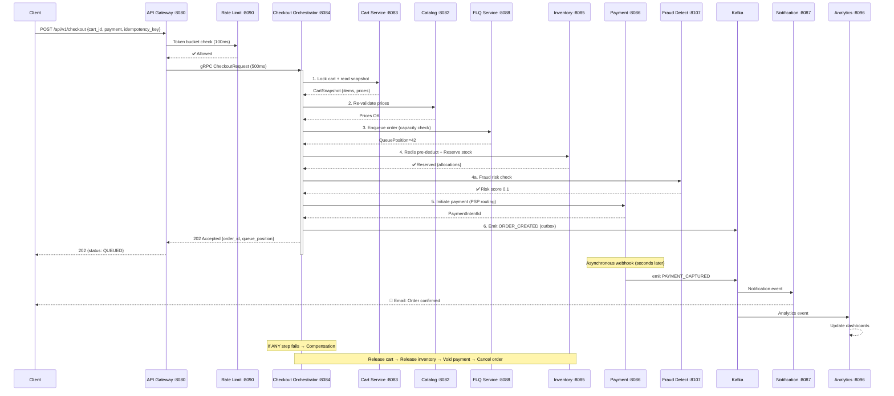

---

## 4. EVENT-DRIVEN DATA FLOW (Kafka Topics)

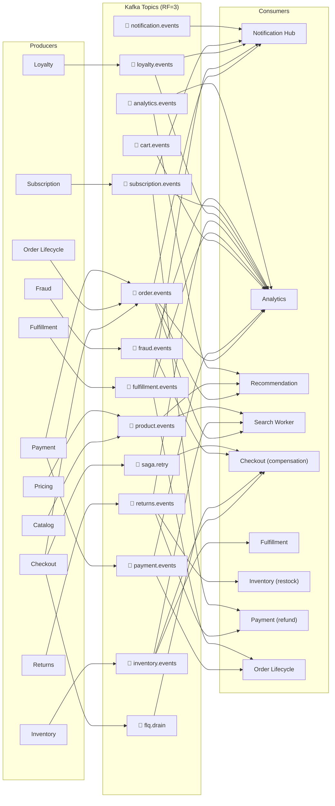

---

## 5. DATABASE & POLYGLOT PERSISTENCE

```mermaid
flowchart TB
    subgraph Postgres["🗄️ PostgreSQL (ACID, 30 DBs)"]
        direction TB
        DB_AUTH[("auth_db")]
        DB_CAT[("catalog_db")]
        DB_ORD[("orders_db")]
        DB_INV[("inventory_db")]
        DB_PAY[("payment_db")]
        DB_WAL[("wallet_db")]
        DB_LOY[("loyalty_db")]
        DB_SUB[("subscription_db")]
        DB_GIFT[("gift_card_db")]
        DB_SEL[("seller_db")]
        DB_PAYOUT[("payout_db")]
        DB_FUL[("fulfillment_db")]
        DB_SHIP[("shipping_db")]
        DB_WH[("webhook_db")]
        DB_FF[("feature_flag_db")]
        DB_OTHER[("... 15 more DBs")]
    end

    subgraph Redis["⚡ Redis Cluster (Sub-ms)"]
        direction TB
        R_CART["Cart hashes"]
        R_SESS["Sessions"]
        R_HOT["Hot SKU counters"]
        R_LOCK["Distributed locks"]
        R_RL["Rate limit buckets"]
        R_FLQ["Flash sale queues"]
        R_FLAG["Feature flags"]
        R_RISK["Fraud risk scores"]
        R_POINTS["Loyalty points cache"]
    end

    subgraph ES["🔍 Elasticsearch"]
        direction TB
        ES_CAT["Product index<br/>6 shards 2 replicas"]
        ES_AUTO["Autocomplete index"]
    end

    subgraph CH["📊 ClickHouse"]
        direction TB
        CH_EV["Event stream"]
        CH_COOC["Co-occurrence matrix"]
        CH_AN["Analytics marts"]
    end

    subgraph KF["📨 Kafka (3 brokers)"]
        direction TB
        K_ORD["order.events"]
        K_PAY["payment.events"]
        K_INV["inventory.events"]
        K_ALL["16 topics total"]
    end

    subgraph NEO["🔗 Neo4j (optional)"]
        NEO_PROD["Customer-Product graph"]
    end

    subgraph PGS["📍 PostGIS"]
        PGS_LOC["Geospatial zones"]
    end

    %% Service to DB mappings
    CAT["Catalog :8082"] --> DB_CAT
    PRIC["Pricing :8101"] --> DB_CAT
    ORD["Order :8106"] --> DB_ORD
    INV["Inventory :8085"] --> DB_INV
    PAY["Payment :8086"] --> DB_PAY
    WAL["Wallet :8113"] --> DB_WAL
    LOY["Loyalty :8112"] --> DB_LOY
    SUB["Subscription :8114"] --> DB_SUB
    GIFT["GiftCard :8115"] --> DB_GIFT
    SEL["Seller :8092"] --> DB_SEL
    POT["Payout :8093"] --> DB_PAYOUT
    FUL["Fulfillment :8108"] --> DB_FUL
    SHIP["Shipping :8109"] --> DB_SHIP
    WH["Webhook :8097"] --> DB_WH
    FF["FeatureFlag :8091"] --> DB_FF

    CART["Cart :8083"] --> R_CART
    AUTH["Auth :8081"] --> R_SESS
    INV --> R_HOT
    ORDER["Order :8084"] --> R_LOCK
    RL["RateLimit :8090"] --> R_RL
    FQ["FLQ :8088"] --> R_FLQ
    FFL["FeatureFlag :8091"] --> R_FLAG
    FR["Fraud :8107"] --> R_RISK
    LOY --> R_POINTS

    SER["Search :8103"] --> ES_CAT
    SW["SearchWorker :8104"] --> ES_CAT
    CAT --> ES_CAT

    AN["Analytics :8096"] --> CH_AN
    REC["Rec :8089"] --> CH_COOC

    PAY --> KF
    ORD --> KF
    INV --> KF

    REC --> NEO
    LOC["Location :8110"] --> PGS

    style Postgres fill:#336791,color:#fff
    style Redis fill:#d82c20,color:#fff
    style ES fill:#fec514,color:#000
    style CH fill:#ffcc01,color:#000
    style KF fill:#262626,color:#fff
    style NEO fill:#4581c3,color:#fff
    style PGS fill:#336791,color:#fff
```

---

## 6. CACHING ARCHITECTURE

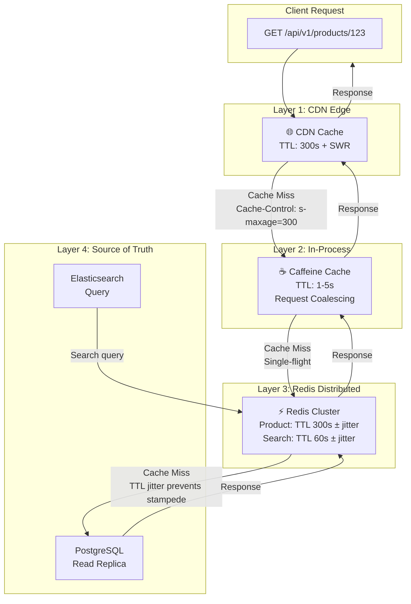

---

## 7. DEPLOYMENT TOPOLOGY (KUBERNETES)

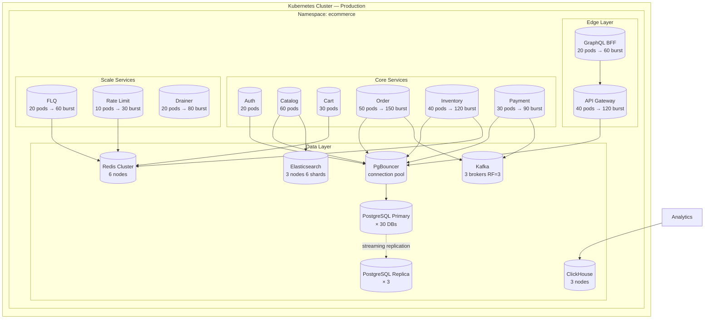

---

## 8. RESILIENCE & CIRCUIT BREAKER FLOW

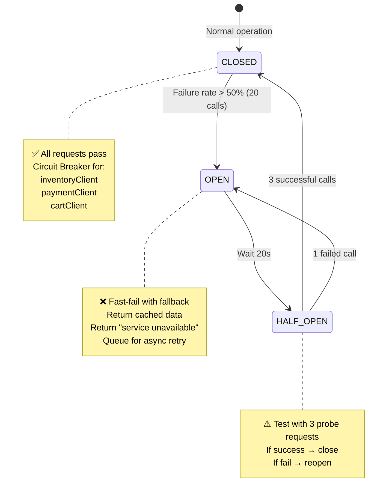

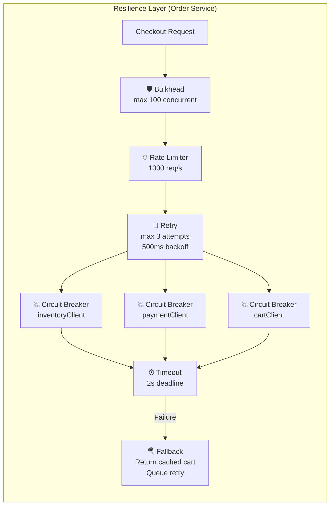

---

## 9. SECURITY ARCHITECTURE

```mermaid
flowchart LR
    subgraph External["External Traffic"]
        ATTACK["Malicious Traffic"]
        LEGIT["Legitimate User"]
    end

    subgraph Security["Security Layers"]
        WAF["🛡 WAF<br/>OWASP rules<br/>Bot detection"]
        RATE["⏱ Rate Limit<br/>Token bucket<br/>per IP/user/tenant"]
        AUTH["🔐 JWT Auth<br/>RS256<br/>15min expiry"]
        MFA["🔑 MFA<br/>TOTP/SMS/OTP"]
        TLS["🔒 mTLS<br/>Service-to-service"]
        SECRETS["🔑 Vault/KMS<br/>secret rotation"]
    end

    subgraph Services["Services"]
        SERVICE["Internal Services"]
    end

    ATTACK --> WAF
    LEGIT --> WAF
    WAF --> RATE
    RATE --> AUTH
    AUTH --> MFA
    MFA --> TLS
    TLS --> SERVICE
    SECRETS -.->|"inject secrets"| SERVICE

    note right of WAF: Blocks SQLi, XSS, DDoS
    note right of RATE: 10K RPS tenant, 100 RPS user
    note right of AUTH: JWT with tenant claim
    note right of MFA: Optional per tenant config
    note right of TLS: mTLS via service mesh (Istio/Linkerd)
    note right of SECRETS: DB creds rotate every 30 days
```

---

## 10. OBSERVABILITY & MONITORING

```mermaid
flowchart TB
    subgraph Services2["Instrumented Services"]
        SVC1["Order Service"]
        SVC2["Payment Service"]
        SVC3["All 40 Services"]
    end

    subgraph Collect["Collection Layer"]
        OTel["📡 OpenTelemetry SDK<br/>traces + metrics + logs"]
        PROM["📊 Prometheus<br/>scrapes /metrics"]
        TEMPO["⏱ Tempo<br/>trace backend"]
        LOKI["📋 Loki<br/>log aggregation"]
    end

    subgraph Visualize["Visualization"]
        GRAFANA["📈 Grafana Dashboards"]
        ALERT["🚨 Alertmanager"]
        PAGER["📟 PagerDuty/On-call"]
    end

    SVC1 --> OTel
    SVC2 --> OTel
    SVC3 --> OTel
    OTel --> PROM & TEMPO & LOKI
    PROM --> GRAFANA
    TEMPO --> GRAFANA
    LOKI --> GRAFANA
    GRAFANA -->|"SLO breach"| ALERT
    ALERT --> PAGER

    note right of GRAFANA
        Checkout P95 < 1.5s
        Inventory P95 < 100ms
        Search P95 < 50ms
        Availability 99.999%
    end note
```

---

## 11. SERVICE DISCOVERY & INTER-SERVICE COMMUNICATION

```mermaid
flowchart TB
    subgraph Registry["Service Discovery (Eureka/Consul)"]
        REG[("Service Registry<br/>healthy instance list")]
    end

    subgraph Comm["Communication Patterns"]
        sync["🔗 Synchronous gRPC<br/>HTTP/2 + mTLS<br/>500ms-2s timeouts"]
        async["📨 Async Kafka<br/>Event-driven<br/>Outbox pattern"]
    end

    subgraph Example["Example: Checkout Flow"]
        ORDER_SVC["Order Service"]
        INVENTORY_SVC["Inventory Service"]
        PAYMENT_SVC["Payment Service"]
    end

    ORDER_SVC -->|"1. Discover inventory"| REG
    REG -->|"2. Healthy instance"| ORDER_SVC
    ORDER_SVC -->|"3. gRPC Reserve (sync)"| INVENTORY_SVC
    ORDER_SVC -->|"4. gRPC Initiate (sync)"| PAYMENT_SVC
    ORDER_SVC -->|"5. Emit event (async)"| async
    async --> INVENTORY_SVC
    async --> PAYMENT_SVC

    note right of sync
        Cart load: 500ms
        Price validate: 500ms
        Inventory reserve: 2s
        Payment initiate: 2s
    end note

    note right of async
        Order events → Kafka
        Notification → Kafka
        Analytics → Kafka
        Compensation → Kafka retry
    end note
```

---

## 12. SCALE & AUTOSCALING

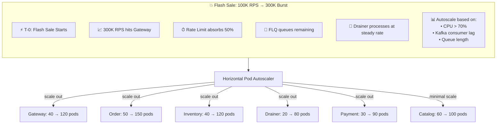

---

## 13. ARCHITECTURE ASSESSMENTS

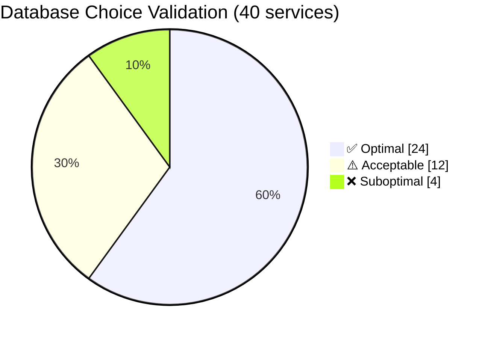

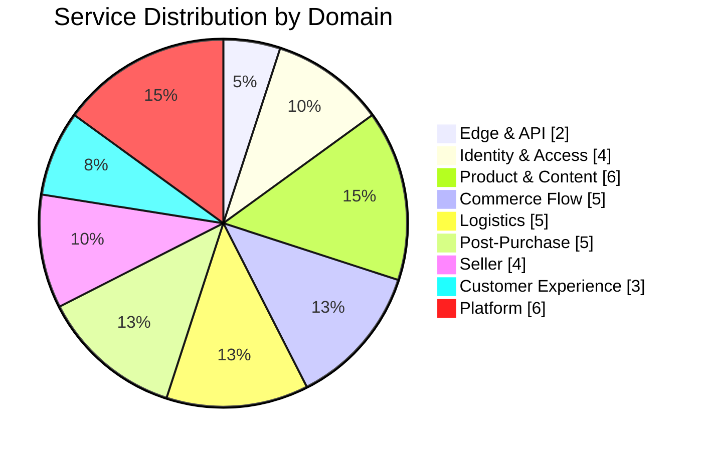

---

## SUMMARY

The e-commerce platform architecture consists of:

| Metric | Value |
|---|---|
| **Total Microservices** | 40 backend + 2 frontends |
| **Domains** | 9 distinct bounded contexts |
| **Databases** | 30 PostgreSQL DBs + Redis + ES + ClickHouse + Kafka (+ Neo4j/PostGIS optional) |
| **Kafka Topics** | 16 topics with RF=3 |
| **Communication** | gRPC (sync) + Kafka (async) |
| **Resilience** | Circuit breakers, bulkheads, retry, rate limiters, timeouts |
| **Observability** | OTel + Prometheus + Grafana + Tempo + Loki |
| **Security** | mTLS, JWT, MFA, WAF, Vault/KMS |
| **Scale** | 100K RPS steady, 300K burst via HPA |
| **Availability** | 99.999% (5.26 min/yr downtime) |